<div style="border:solid Chocolate 2px; padding: 40px">

<b>Сергей, привет!👋</b>

Меня зовут Арина У., я буду ревьюером твоего проекта. Ты можешь обращаться ко мне на "ты"😏 

Пожалуйста, не удаляй мои комментарии, они будут особенно полезны для нашей работы в случае повторной проверки проекта. 

Ты также можешь реагировать на мои комментарии своими, выделяя их цветами и наиболее понравившимся тебе способом оформления, но явно  отличающимся от моих комментариев. Это нужно, чтобы не создавалась путаница😉

Ты можешь найти мои комментарии, обозначенные <font color='green'>зеленым</font>, <font color='gold'>желтым</font> и <font color='red'>красным</font> цветами, например:

<br/>

<div class="alert alert-success">
<h2> Комментарий ревьюера <a class="tocSkip"> </h2>

<b>Все отлично!👍:</b> В случае, если решение на отдельном шаге является полностью правильным.
</div>

<br/>

<div class="alert alert-warning">
    <h2> Комментарий ревьюера <a class="tocSkip"> </h2>
    
<b>Некоторые замечания и рекомендации💡:</b> В случае, когда решение на отдельном шаге станет еще лучше, если внести небольшие коррективы.
</div>


<br/>

<div class="alert alert-block alert-danger">
<h2> Комментарий ревьюера <a class="tocSkip"></h2>

    
<b>На доработку🤔:</b> В случае, когда решение на отдельном шаге требует существенной переработки и внесения правок. Напоминаю, что проект не может быть принят с первого раза, если ревью содержит комментарии, рекомендующие доработать шаги.
</div>
    
Увидев у тебя ошибку, в первый раз я лишь укажу на ее наличие и дам тебе возможность самому найти и исправить ее. На реальной работе твой руководитель будет поступать также, и я пытаюсь подготовить тебя именно к работе аналитиком. Но если ты пока не справишься с такой задачей - при следующей проверке я дам более точную подсказку!🤓

# Проект №4 (Сборный). Анализ популярности компьютерных игр

# Оглавление
1. [Введение](#section1)
    * [Описание проекта](#section1.1)
    * [Описание данных](#section1.2)


2. [Изучение общей информации о наборе данных](#section2)
    * [Обзор датасета](#section2.1)
    * [Выводы второго раздела](#section2.2)
    
    
3. [Предобработка данных](#section3)
    * [Изменение названий столбцов](#section3.1)
    * [Устранение пропусков в данных](#section3.2)
    * [Приведение данных к нужным типам](#section3.3)
    * [Расчет и добавление суммарных продаж во всех регионах](#section3.4)   
    * [Выводы третьего раздела](#section3.5)
    
    
4. [Исследование данных](#section4)
    * [Анализ количества игр по годам](#section4.1)
    * [Анализ продаж игр по платформам](#section4.2)
    * [Анализ продаж игр за текущий период](#section4.3)   
    * [Анализ влияния отзывов пользователей и критиков на продажи игр](#section4.4)
    * [Анализ жанров игр](#section4.5)
    * [Выводы четвертого раздела](#section4.6)
    
    
5. [Составление портрета пользователя каждого региона](#section5)
    * [Определение самых популярных платформ в заданных регионах](#section5.1)
    * [Определение самых популярных жанров в заданных регионах](#section5.2)
    * [Анализ влияния рейтинга ESRB на продажи в отдельном регионе](#section5.3)
    * [Выводы пятого раздела](#section5.4)
    
    
6. [Проверка статистических гипотез](#section6)
    * [Гипотеза 1. Средние пользовательские рейтинги платформ Xbox One и PC одинаковые](#section6.1)
    * [Гипотеза 2. Средние пользовательские рейтинги жанров Action и Sports разные](#section6.2)
    * [Выводы шестого раздела](#section6.3)
    
    
7. [Общие выводы проекта](#section7)   

<a id='section1'></a>
## Введение

<a id='section1.1'></a>
### Описание проекта

Вы работаете в интернет-магазине «Стримчик», который продаёт по всему миру компьютерные игры. Из открытых источников доступны исторические данные о продажах игр, оценки пользователей и экспертов, жанры и платформы (например, Xbox или PlayStation). Перед вами данные до 2016 года. Представим, что сейчас декабрь 2016 г., и вы планируете кампанию на 2017-й.


**Цель проекта: выявление определяющих успешность игры закономерностей для планирования рекламных кампаний на следующий год**

<a id='section1.2'></a>
### Описание данных

**Датасет**
- /datasets/games.csv

**Описание столбцов**
- Name — название игры
- Platform — платформа
- Year_of_Release — год выпуска
- Genre — жанр игры
- NA_sales — продажи в Северной Америке (миллионы проданных копий)
- EU_sales — продажи в Европе (миллионы проданных копий)
- JP_sales — продажи в Японии (миллионы проданных копий)
- Other_sales — продажи в других странах (миллионы проданных копий)
- Critic_Score — оценка критиков (максимум 100)
- User_Score — оценка пользователей (максимум 10)
- Rating — рейтинг от организации ESRB (англ. Entertainment Software Rating Board). Эта ассоциация определяет рейтинг компьютерных игр и присваивает им подходящую возрастную категорию, например, «Для взрослых», «Для детей младшего возраста» или «Для подростков»


Данные за 2016 год могут быть неполными.

<div class="alert alert-success">
<h2> Комментарий ревьюера <a class="tocSkip"> </h2>

<b>Все отлично!👍:</b> 
    
Очень здорово, что ты начинаешь проект с такого подробного введения, так держать!

<a id='section2'></a>
## Изучение общей информации о наборе данных

<a id='section2.1'></a>
### Обзор датасета

#### Импорт библиотек


```python
import pandas as pd
import matplotlib.pyplot as plt
import numpy as np
import warnings
warnings.filterwarnings('ignore')

from scipy import stats as st
from scipy.stats import levene
```

#### Обзор таблицы **games**


```python
#Обзор таблицы, типов данных столбцов и характерных значений
games = pd.read_csv('/datasets/games.csv')

print('\033[1m','Случайные 10 строк таблицы:','\033[0m')
display(games.sample(10))

print('\033[1m','Информация о типах данных:\n', '\033[0m')
print(games.info(),'\n')

print('\033[1m', 'Доля пропусков в столбцах:\n', '\033[0m')
report = games.isna().sum().to_frame()
report = report.rename(columns = {0: 'missing_values'})
report['% of total'] = (100*(report['missing_values'] / games.shape[0])).astype(int)
report.sort_values(by = 'missing_values', ascending = False)
print(report)

print('\033[1m', '\nКоличество дубликатов:', '\033[0m', games.duplicated().sum(),'\n')

print('\033[1m', 'Характерные значения:\n', '\033[0m')
games.describe()
```

     Случайные 10 строк таблицы: 


<div>
<style scoped>
    .dataframe tbody tr th:only-of-type {
        vertical-align: middle;
    }

    .dataframe tbody tr th {
        vertical-align: top;
    }

    .dataframe thead th {
        text-align: right;
    }
</style>
<table border="1" class="dataframe">
  <thead>
    <tr style="text-align: right;">
      <th></th>
      <th>Name</th>
      <th>Platform</th>
      <th>Year_of_Release</th>
      <th>Genre</th>
      <th>NA_sales</th>
      <th>EU_sales</th>
      <th>JP_sales</th>
      <th>Other_sales</th>
      <th>Critic_Score</th>
      <th>User_Score</th>
      <th>Rating</th>
    </tr>
  </thead>
  <tbody>
    <tr>
      <td>11400</td>
      <td>Cloudy With a Chance of Meatballs</td>
      <td>PSP</td>
      <td>2009.0</td>
      <td>Platform</td>
      <td>0.07</td>
      <td>0.00</td>
      <td>0.00</td>
      <td>0.01</td>
      <td>NaN</td>
      <td>tbd</td>
      <td>E</td>
    </tr>
    <tr>
      <td>10860</td>
      <td>Little League World Series Baseball 2008</td>
      <td>Wii</td>
      <td>2008.0</td>
      <td>Sports</td>
      <td>0.09</td>
      <td>0.00</td>
      <td>0.00</td>
      <td>0.01</td>
      <td>70.0</td>
      <td>8</td>
      <td>E</td>
    </tr>
    <tr>
      <td>1164</td>
      <td>Mario Bros.</td>
      <td>2600</td>
      <td>1982.0</td>
      <td>Platform</td>
      <td>1.48</td>
      <td>0.09</td>
      <td>0.00</td>
      <td>0.02</td>
      <td>NaN</td>
      <td>NaN</td>
      <td>NaN</td>
    </tr>
    <tr>
      <td>7204</td>
      <td>ECW Hardcore Revolution</td>
      <td>N64</td>
      <td>2000.0</td>
      <td>Fighting</td>
      <td>0.18</td>
      <td>0.04</td>
      <td>0.00</td>
      <td>0.00</td>
      <td>NaN</td>
      <td>NaN</td>
      <td>NaN</td>
    </tr>
    <tr>
      <td>1459</td>
      <td>Need for Speed Carbon</td>
      <td>PS2</td>
      <td>2006.0</td>
      <td>Racing</td>
      <td>1.22</td>
      <td>0.05</td>
      <td>0.05</td>
      <td>0.01</td>
      <td>74.0</td>
      <td>8.4</td>
      <td>E10+</td>
    </tr>
    <tr>
      <td>16033</td>
      <td>FIFA Soccer 08</td>
      <td>PC</td>
      <td>2007.0</td>
      <td>Sports</td>
      <td>0.00</td>
      <td>0.01</td>
      <td>0.00</td>
      <td>0.00</td>
      <td>77.0</td>
      <td>6.1</td>
      <td>E</td>
    </tr>
    <tr>
      <td>9151</td>
      <td>WCW Backstage Assault</td>
      <td>N64</td>
      <td>NaN</td>
      <td>Action</td>
      <td>0.11</td>
      <td>0.03</td>
      <td>0.00</td>
      <td>0.00</td>
      <td>NaN</td>
      <td>NaN</td>
      <td>NaN</td>
    </tr>
    <tr>
      <td>593</td>
      <td>Style Savvy</td>
      <td>DS</td>
      <td>2008.0</td>
      <td>Simulation</td>
      <td>0.62</td>
      <td>0.82</td>
      <td>0.96</td>
      <td>0.18</td>
      <td>73.0</td>
      <td>7.7</td>
      <td>E</td>
    </tr>
    <tr>
      <td>4834</td>
      <td>Avatar: The Game</td>
      <td>DS</td>
      <td>2009.0</td>
      <td>Action</td>
      <td>0.18</td>
      <td>0.18</td>
      <td>0.00</td>
      <td>0.04</td>
      <td>NaN</td>
      <td>NaN</td>
      <td>NaN</td>
    </tr>
    <tr>
      <td>15278</td>
      <td>PachiPara 15: Super Umi Monogatari in Okinawa 2</td>
      <td>PS3</td>
      <td>2010.0</td>
      <td>Misc</td>
      <td>0.00</td>
      <td>0.00</td>
      <td>0.02</td>
      <td>0.00</td>
      <td>NaN</td>
      <td>NaN</td>
      <td>NaN</td>
    </tr>
  </tbody>
</table>
</div>


     Информация о типах данных:
     
    <class 'pandas.core.frame.DataFrame'>
    RangeIndex: 16715 entries, 0 to 16714
    Data columns (total 11 columns):
    Name               16713 non-null object
    Platform           16715 non-null object
    Year_of_Release    16446 non-null float64
    Genre              16713 non-null object
    NA_sales           16715 non-null float64
    EU_sales           16715 non-null float64
    JP_sales           16715 non-null float64
    Other_sales        16715 non-null float64
    Critic_Score       8137 non-null float64
    User_Score         10014 non-null object
    Rating             9949 non-null object
    dtypes: float64(6), object(5)
    memory usage: 1.4+ MB
    None 
    
     Доля пропусков в столбцах:
     
                     missing_values  % of total
    Name                          2           0
    Platform                      0           0
    Year_of_Release             269           1
    Genre                         2           0
    NA_sales                      0           0
    EU_sales                      0           0
    JP_sales                      0           0
    Other_sales                   0           0
    Critic_Score               8578          51
    User_Score                 6701          40
    Rating                     6766          40
     
    Количество дубликатов:  0 
    
     Характерные значения:
     


<div>
<style scoped>
    .dataframe tbody tr th:only-of-type {
        vertical-align: middle;
    }

    .dataframe tbody tr th {
        vertical-align: top;
    }

    .dataframe thead th {
        text-align: right;
    }
</style>
<table border="1" class="dataframe">
  <thead>
    <tr style="text-align: right;">
      <th></th>
      <th>Year_of_Release</th>
      <th>NA_sales</th>
      <th>EU_sales</th>
      <th>JP_sales</th>
      <th>Other_sales</th>
      <th>Critic_Score</th>
    </tr>
  </thead>
  <tbody>
    <tr>
      <td>count</td>
      <td>16446.000000</td>
      <td>16715.000000</td>
      <td>16715.000000</td>
      <td>16715.000000</td>
      <td>16715.000000</td>
      <td>8137.000000</td>
    </tr>
    <tr>
      <td>mean</td>
      <td>2006.484616</td>
      <td>0.263377</td>
      <td>0.145060</td>
      <td>0.077617</td>
      <td>0.047342</td>
      <td>68.967679</td>
    </tr>
    <tr>
      <td>std</td>
      <td>5.877050</td>
      <td>0.813604</td>
      <td>0.503339</td>
      <td>0.308853</td>
      <td>0.186731</td>
      <td>13.938165</td>
    </tr>
    <tr>
      <td>min</td>
      <td>1980.000000</td>
      <td>0.000000</td>
      <td>0.000000</td>
      <td>0.000000</td>
      <td>0.000000</td>
      <td>13.000000</td>
    </tr>
    <tr>
      <td>25%</td>
      <td>2003.000000</td>
      <td>0.000000</td>
      <td>0.000000</td>
      <td>0.000000</td>
      <td>0.000000</td>
      <td>60.000000</td>
    </tr>
    <tr>
      <td>50%</td>
      <td>2007.000000</td>
      <td>0.080000</td>
      <td>0.020000</td>
      <td>0.000000</td>
      <td>0.010000</td>
      <td>71.000000</td>
    </tr>
    <tr>
      <td>75%</td>
      <td>2010.000000</td>
      <td>0.240000</td>
      <td>0.110000</td>
      <td>0.040000</td>
      <td>0.030000</td>
      <td>79.000000</td>
    </tr>
    <tr>
      <td>max</td>
      <td>2016.000000</td>
      <td>41.360000</td>
      <td>28.960000</td>
      <td>10.220000</td>
      <td>10.570000</td>
      <td>98.000000</td>
    </tr>
  </tbody>
</table>
</div>


<div class="alert alert-success">
<h2> Комментарий ревьюера <a class="tocSkip"> </h2>

<b>Все отлично!👍:</b> 
    
Очень крутое представление данных на этом шаге анализа, ты молодец!

<a id='section2.2'></a>
### Выводы второго раздела

После визуальной оценки данных видно, что:

- Навания столбцов начинаются с верхнего регистра. Приведем к нижнему для удобства обработки данных

- В столбцах Name, Year_of_release, Genre есть пропуски. Очистим данные от них, так как их количество в сумме меньше 2% общего количества

- Столбцы Critic_score, User_score, Rating также содержат пропуски (40-50% данных). Это рейтинговые значения, которые для старых игр могли быть в принципе не рассчитаны (так как могло не существовать рейтинговых агенств - ESRB была основана в 1994 году). Проанализируем их далее.

- Тип данных столбцов Year_of_release и User_Score - object. Логично Year_of_release привести к int, а User_Score - к float64.

- Присутвует большое количество нулевых значений продаж для регионов. Возможно это связано с большим количеством игр в списке, которые продавались только локально. Изучим подробно на этапе анализа регионов.

<div class="alert alert-success">
<h2> Комментарий ревьюера <a class="tocSkip"> </h2>

<b>Все отлично!👍:</b> 
    
Соглашусь с твоими выводами после первого знакомства с данными! Основной фронт работы определен, проблемы в данных выявлены, давай посмотрим, что у тебя получилось на последующих шагах👀

<a id='section3'></a>
## Предобработка данных

<a id='section3.1'></a>
### Изменение названий столбцов


```python
games.columns = games.columns.str.lower() 
```

<a id='section3.2'></a>
### Устранение пропусков в данных

#### Удаление пропусков name, year_of_release, genre


```python
games = games.dropna(subset = ['name', 'year_of_release', 'genre']).reset_index(drop = True)
games.info()
```

    <class 'pandas.core.frame.DataFrame'>
    RangeIndex: 16444 entries, 0 to 16443
    Data columns (total 11 columns):
    name               16444 non-null object
    platform           16444 non-null object
    year_of_release    16444 non-null float64
    genre              16444 non-null object
    na_sales           16444 non-null float64
    eu_sales           16444 non-null float64
    jp_sales           16444 non-null float64
    other_sales        16444 non-null float64
    critic_score       7983 non-null float64
    user_score         9839 non-null object
    rating             9768 non-null object
    dtypes: float64(6), object(5)
    memory usage: 1.4+ MB


#### Обработка пропусков столбцов critic_score, user_score, rating


```python
print('Столбец critic_score:', games['critic_score'].unique(),'\n\n')
print('Столбец user_score:', games['user_score'].unique(),'\n\n')
print('Столбец rating:', games['rating'].unique(),'\n\n')
```

    Столбец critic_score: [76. nan 82. 80. 89. 58. 87. 91. 61. 97. 95. 77. 88. 83. 94. 93. 85. 86.
     98. 96. 90. 84. 73. 74. 78. 92. 71. 72. 68. 62. 49. 67. 81. 66. 56. 79.
     70. 59. 64. 75. 60. 63. 69. 50. 25. 42. 44. 55. 48. 57. 29. 47. 65. 54.
     20. 53. 37. 38. 33. 52. 30. 32. 43. 45. 51. 40. 46. 39. 34. 41. 36. 31.
     27. 35. 26. 19. 28. 23. 24. 21. 17. 13.] 
    
    
    Столбец user_score: ['8' nan '8.3' '8.5' '6.6' '8.4' '8.6' '7.7' '6.3' '7.4' '8.2' '9' '7.9'
     '8.1' '8.7' '7.1' '3.4' '5.3' '4.8' '3.2' '8.9' '6.4' '7.8' '7.5' '2.6'
     '7.2' '9.2' '7' '7.3' '4.3' '7.6' '5.7' '5' '9.1' '6.5' 'tbd' '8.8' '6.9'
     '9.4' '6.8' '6.1' '6.7' '5.4' '4' '4.9' '4.5' '9.3' '6.2' '4.2' '6' '3.7'
     '4.1' '5.8' '5.6' '5.5' '4.4' '4.6' '5.9' '3.9' '3.1' '2.9' '5.2' '3.3'
     '4.7' '5.1' '3.5' '2.5' '1.9' '3' '2.7' '2.2' '2' '9.5' '2.1' '3.6' '2.8'
     '1.8' '3.8' '0' '1.6' '9.6' '2.4' '1.7' '1.1' '0.3' '1.5' '0.7' '1.2'
     '2.3' '0.5' '1.3' '0.2' '0.6' '1.4' '0.9' '1' '9.7'] 
    
    
    Столбец rating: ['E' nan 'M' 'T' 'E10+' 'K-A' 'AO' 'EC' 'RP'] 
    
    


**Вывод: видно, что в user_score присутствуют как нулевые значения , так и пропуски и tbd (что означает 'to be defined'). Чтобы не смешивать реальные нулевые рейтинги с пропусками, приведем tbd к NaN. Пропуски rating установим как undefined. critic_score модифицировать не будем**


```python
games['user_score'] = games['user_score'].replace('tbd', np.nan)
games['rating'] = games['rating'].replace(np.nan, 'undefined')

print('Столбец user_score:', games['user_score'].unique(),'\n\n')
print('Столбец rating:', games['rating'].unique(),'\n\n')
```

    Столбец user_score: ['8' nan '8.3' '8.5' '6.6' '8.4' '8.6' '7.7' '6.3' '7.4' '8.2' '9' '7.9'
     '8.1' '8.7' '7.1' '3.4' '5.3' '4.8' '3.2' '8.9' '6.4' '7.8' '7.5' '2.6'
     '7.2' '9.2' '7' '7.3' '4.3' '7.6' '5.7' '5' '9.1' '6.5' '8.8' '6.9' '9.4'
     '6.8' '6.1' '6.7' '5.4' '4' '4.9' '4.5' '9.3' '6.2' '4.2' '6' '3.7' '4.1'
     '5.8' '5.6' '5.5' '4.4' '4.6' '5.9' '3.9' '3.1' '2.9' '5.2' '3.3' '4.7'
     '5.1' '3.5' '2.5' '1.9' '3' '2.7' '2.2' '2' '9.5' '2.1' '3.6' '2.8' '1.8'
     '3.8' '0' '1.6' '9.6' '2.4' '1.7' '1.1' '0.3' '1.5' '0.7' '1.2' '2.3'
     '0.5' '1.3' '0.2' '0.6' '1.4' '0.9' '1' '9.7'] 
    
    
    Столбец rating: ['E' 'undefined' 'M' 'T' 'E10+' 'K-A' 'AO' 'EC' 'RP'] 
    
    


<div class="alert alert-success">
<h2> Комментарий ревьюера <a class="tocSkip"> </h2>

<b>Все отлично!👍:</b> 
    
Да, стратегия обработки значения `tbd` правильная, все получилось!

<div class="alert alert-warning">
    <h2> Комментарий ревьюера <a class="tocSkip"> </h2>
    
<b>Некоторые замечания и рекомендации💡:</b> 
    
Важно проанализировать пропущенные значения. Полезно посмотреть не просто на пропуски в данных, а на процент пропусков по колонкам, это можно сделать,  например, так:
    
`data.isnull().sum()*100/len(data)`

Более продвинутый вариант (кол-во пропусков + процент пропусков)
    
`report = data.isna().sum().to_frame()
report = report.rename(columns = {0: 'missing_values'})
report['% of total'] = (report['missing_values'] / data.shape[0]).round(2)
report.sort_values(by = 'missing_values', ascending = False)`
    
Это полезное действие при подборе стратегии заполнения пропусков: обычно, если в данных кол-во пропусков превышает 10%, восполнение пропусков результатами выполнения стандартных операций типа расчета среднего/медианы по столбцу, может привести к искажению данных. Если мы сталкиваемся с такой ситуацией, то важно подумать и подобрать более сложную восполнения пропусков в данных.

<div class="alert alert-success">
<h2> Комментарий ревьюера <a class="tocSkip"> </h2>

<b>Все отлично!👍:</b> 
    
Со стратегией, которую ты предложил для работы с пропусками в колонках user_score, critic_score, я абсолютно солидарна! Данные в рассматриваемых колонках довольно чувствительные, и замена пропусков в этих колонках могла бы привести к искажению исходных данных, как ты правильно отметил. Наиболее корректный способ восполнить подобные пропуски - обратиться к первоисточнику, но, поскольку у нас нет такой возможности, лучше оставить пропуски как есть или заменить их на маркеры для того, чтобы  вдальнейшем отсеять.

<div class="alert alert-warning">
    <h2> Комментарий ревьюера <a class="tocSkip"> </h2>
    
<b>Некоторые замечания и рекомендации💡:</b> 
        
Сергей, пропуски в колонке `rating` я бы посоветовала заменить на `undefined`.  Это важно потому, что на более поздних этапах анализа (когда будет анализировать рейтинг по регионам) важно включить в анализ игры без рейтинга и сравнить их с теми играми, у которых рейтинг есть.

<div class="alert alert-block alert-info">
    
**Добрботка студента**
    
- Добавил подробнуй информацию о пропусках в колонках. 

- Заменил пропуски в rating на undefined</div>

<div class="alert alert-success">
<h2> Комментарий ревьюера: вторая итерация ревью <a class="tocSkip"> </h2>

<b>Все отлично!👍:</b> 
    
Отлично, вижу твои коррективы!

<a id='section3.3'></a>
### Приведение данных к нужным типам


```python
games['year_of_release'] = games['year_of_release'].astype(int)
games['user_score'] = games['user_score'].astype(float)
games.info()
```

    <class 'pandas.core.frame.DataFrame'>
    RangeIndex: 16444 entries, 0 to 16443
    Data columns (total 11 columns):
    name               16444 non-null object
    platform           16444 non-null object
    year_of_release    16444 non-null int64
    genre              16444 non-null object
    na_sales           16444 non-null float64
    eu_sales           16444 non-null float64
    jp_sales           16444 non-null float64
    other_sales        16444 non-null float64
    critic_score       7983 non-null float64
    user_score         7463 non-null float64
    rating             16444 non-null object
    dtypes: float64(6), int64(1), object(4)
    memory usage: 1.4+ MB


<a id='section3.4'></a>
### Расчет и добавление суммарных продаж во всех регионах


```python
games['total_sales'] = games['na_sales'] + games['eu_sales'] + games['jp_sales'] + games['other_sales']
games.sample(5)
```


<div>
<style scoped>
    .dataframe tbody tr th:only-of-type {
        vertical-align: middle;
    }

    .dataframe tbody tr th {
        vertical-align: top;
    }

    .dataframe thead th {
        text-align: right;
    }
</style>
<table border="1" class="dataframe">
  <thead>
    <tr style="text-align: right;">
      <th></th>
      <th>name</th>
      <th>platform</th>
      <th>year_of_release</th>
      <th>genre</th>
      <th>na_sales</th>
      <th>eu_sales</th>
      <th>jp_sales</th>
      <th>other_sales</th>
      <th>critic_score</th>
      <th>user_score</th>
      <th>rating</th>
      <th>total_sales</th>
    </tr>
  </thead>
  <tbody>
    <tr>
      <td>5306</td>
      <td>NBA 2K12</td>
      <td>Wii</td>
      <td>2011</td>
      <td>Sports</td>
      <td>0.29</td>
      <td>0.03</td>
      <td>0.00</td>
      <td>0.02</td>
      <td>NaN</td>
      <td>6.8</td>
      <td>E</td>
      <td>0.34</td>
    </tr>
    <tr>
      <td>6994</td>
      <td>Spec Ops: The Line</td>
      <td>PC</td>
      <td>2012</td>
      <td>Shooter</td>
      <td>0.11</td>
      <td>0.09</td>
      <td>0.00</td>
      <td>0.02</td>
      <td>76.0</td>
      <td>8.2</td>
      <td>M</td>
      <td>0.22</td>
    </tr>
    <tr>
      <td>15079</td>
      <td>Maji de Manabu: LEC de Ukaru - DS Hishou Boki ...</td>
      <td>DS</td>
      <td>2008</td>
      <td>Misc</td>
      <td>0.00</td>
      <td>0.00</td>
      <td>0.02</td>
      <td>0.00</td>
      <td>NaN</td>
      <td>NaN</td>
      <td>undefined</td>
      <td>0.02</td>
    </tr>
    <tr>
      <td>9039</td>
      <td>TRINITY: Souls of Zill O'll</td>
      <td>PS3</td>
      <td>2010</td>
      <td>Role-Playing</td>
      <td>0.06</td>
      <td>0.03</td>
      <td>0.03</td>
      <td>0.01</td>
      <td>55.0</td>
      <td>6.2</td>
      <td>T</td>
      <td>0.13</td>
    </tr>
    <tr>
      <td>7273</td>
      <td>The Magic School Bus: Oceans</td>
      <td>DS</td>
      <td>2011</td>
      <td>Adventure</td>
      <td>0.20</td>
      <td>0.00</td>
      <td>0.00</td>
      <td>0.02</td>
      <td>NaN</td>
      <td>NaN</td>
      <td>E</td>
      <td>0.22</td>
    </tr>
  </tbody>
</table>
</div>


<a id='section3.5'></a>
### Выводы третьего раздела

На данном этапе была рпоизведена визуальная оценка данных, а также подготовка для дальнейшего анализа:

- Названия столбцов были приведены к нижнему регистру

- Была произведена работа с пропусками к столбце User_score

- Удалены пропуски в столбцах name, year_of_release, genre

- Пропуски в rating заменены на undefined

- В столбцах year_of_release и user_score был заменен тип данных

- Рассчитаны и добавлены значения суммарных продаж по всем регионам

<a id='section4'></a>
## Исследование данных

<a id='section4.1'></a>
### Анализ количества игр по годам


```python
games.groupby('year_of_release')['name'].agg('count').plot(kind = 'bar', figsize=(20, 5), grid = True);
plt.title('Диаграмма распределения количества выпущенных игр')
plt.xlabel('Год выпуска')
plt.ylabel('Количество игр')
plt.show()
```


    
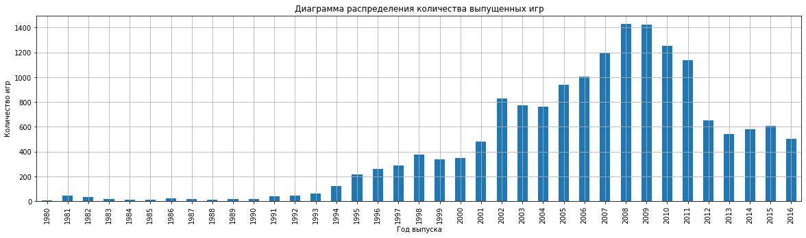
    


**Выводы:** 

- До 1993 года игры выпускались в совсем небольшом количестве (до 100 единиц в год). Позже, с развитием платформы Windows количество игр начало значительно увеличиваться и достигло пика в 2008-2009 годы (около 1400 игр в год). Далее с постепенным развитием мобильных платформ интерес к компьютерным играм упал, количество выпускаемых игр сократилось и вышло на плато к 2012 году (600 игр в год).

- Для определения успешности игры имеет смысл смотреть на период с 1993 по 2016 годы. Более ранние игры в среднем уже утратили свою актуальность и вряд ли помогут в планировании кампании на 2017 год. 

- Возможно, имеет смысл обратить внимание на сверх популярные игры, выпущенные до 1993 года, например Tetris или Super Mario. Однако рассматривать их стоит только как основу для ремейка, который имеет высокий риск не набрать популярность.

<div class="alert alert-warning">
    <h2> Комментарий ревьюера <a class="tocSkip"> </h2>
    
<b>Некоторые замечания и рекомендации💡:</b> 
        
В целом ты построил корректный график, но можно попробовать проделать чуть более сложное, но при этом более корректное действие:  сейчас ты строишь график по годам, т.е. по сути распределение (гистограмму) самих лет (их количества в датасете). Эта стратегия, в целом, дает правильный результат. Но попробуй сгруппировать названия игр (колонка name) по годам (year_of_release) и применить аггрегирующий метод count (agg для метода groupby и aggfunc для метода pivot_table) и потом визуализировать получившиеся данные. Как минимум цена деления на оси y станет точнее, так как мы сможем посмотреть на количество игр в каждый из годов (либо же ты можешь попробовать для твоего графика поменять цену деления). Если используешь предложенный мой вариант с группировкой, должен получиться примерно такой график:


<div class="alert alert-block alert-info">
    
**Добрботка студента**
    
- Применен метод groupby</div>

<div class="alert alert-success">
<h2> Комментарий ревьюера: вторая итерация ревью <a class="tocSkip"> </h2>

<b>Все отлично!👍:</b> 
    
Да, теперь график выглядит максимально наглядно, хорошая работа!

<a id='section4.2'></a>
### Анализ продаж игр по платформам


```python
top_platforms = games.groupby(['platform'])['total_sales'].sum().sort_values(ascending=False).head(10).apply(np.ceil)
top_platforms.to_dict()


for platform in top_platforms.keys():
    games.query('platform == @platform').groupby('year_of_release')['total_sales'].agg('count').plot(grid=True, figsize=(20, 3), kind = 'bar');
    title = 'Диамика продаж игр на платформе ' + str(platform)
    plt.title(title)
    plt.xlabel('Год выпуска')
    plt.ylabel('Продажи в мире, млн. $)')
    plt.show()
```


    
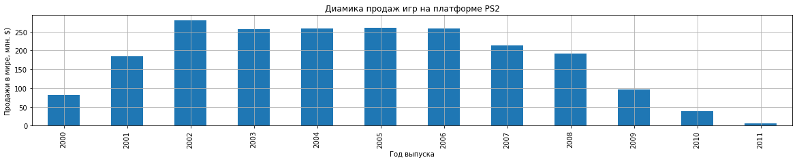
    


    
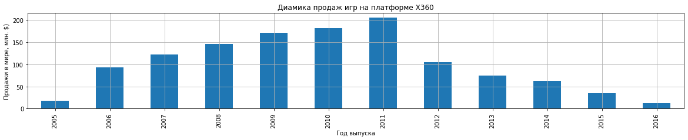
    


    
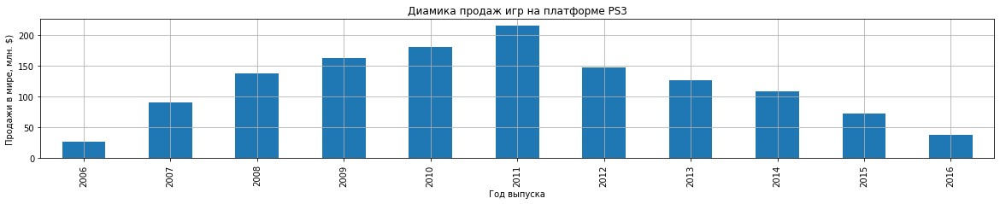
    


    
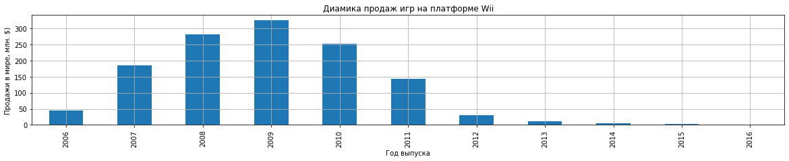
    


    

    


    
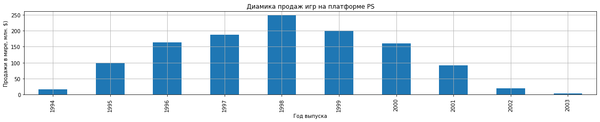
    


    
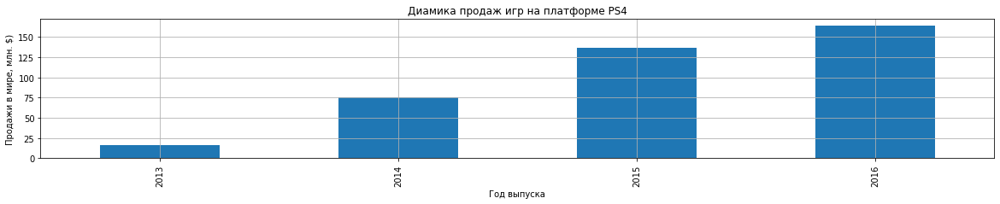
    


    
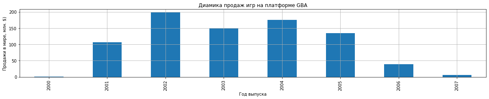
    


    
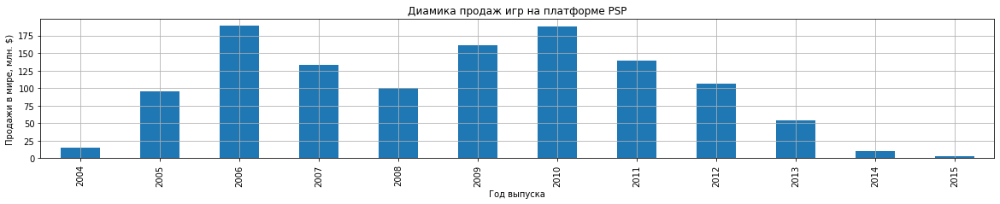
    


    
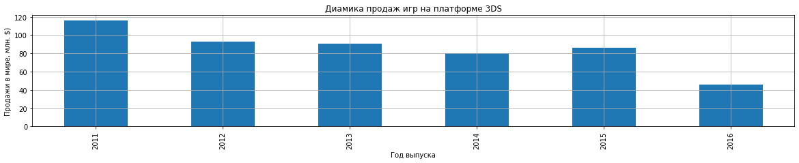
    


**Вывод: видно, что обычно платформам требуется несколько лет (2-4), чтобы выйти на пик популярности. Среднее "время жизни" платформ находится в диапазоне 6-10 лет.**

<div class="alert alert-success">
<h2> Комментарий ревьюера <a class="tocSkip"> </h2>

<b>Все отлично!👍:</b> 
   
Очень интересные и информативные графики! Думаю, в разбивке по платформе картина продаж выглядит яснее!

<div class="alert alert-warning">
    <h2> Комментарий ревьюера <a class="tocSkip"> </h2>
    
<b>Некоторые замечания и рекомендации💡:</b> 
        
Для округления значений ты также можешь использовать метод `np.ceil`
        
        
https://realpython.com/python-rounding/ - Интересный материал про округление в целом.

<div class="alert alert-block alert-info">
    
**Добрботка студента**
    
- Применено округление методом np.ceil</div>

<div class="alert alert-success">
<h2> Комментарий ревьюера: вторая итерация ревью <a class="tocSkip"> </h2>

<b>Все отлично!👍</b> 
    

<a id='section4.3'></a>
### Анализ продаж игр за текущий период

#### Определение актуального периода


```python
modern_games = games.query('year_of_release >= 2000')

modern_platforms = round(modern_games.groupby(['platform'])['total_sales'].sum().sort_values(ascending=False),2)
modern_platforms.to_dict()

for platform in modern_platforms.keys():
    modern_games.query('platform == @platform').groupby('year_of_release')['total_sales'].agg('sum').plot(
        grid=True, figsize=(20, 10), linewidth=3);
    plt.title('Диамика продаж игр на популярных платформах в период с 2000 по 2016 год')
    plt.xlabel('Год выпуска')
    plt.ylabel('Продажи в мире, млн. $)')
    plt.legend(modern_platforms.keys())
```


    
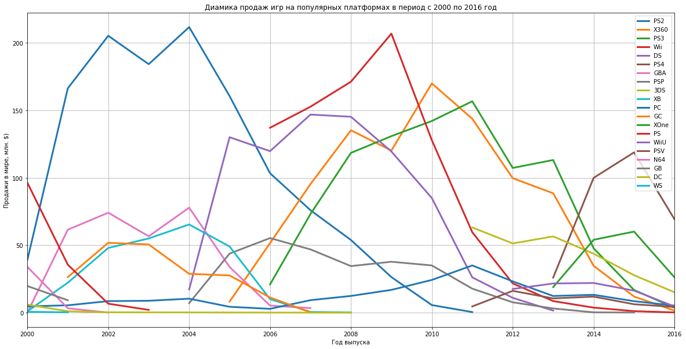
    


**Вывод: для получения прогнозов на 2017 год будем брать период с 2014-2016 год, так как в этом периоде представлены наиболее актуальные платформы**


```python
relevant_games = games.query('year_of_release >= 2014')

relevant_platforms = round(relevant_games.groupby(['platform'])['total_sales'].sum().sort_values(ascending=False),2)
relevant_platforms.to_dict()

for platform in relevant_platforms.keys():
    relevant_games.query('platform == @platform').groupby('year_of_release')['total_sales'].agg('sum').plot(
        grid=True, figsize=(20, 10), linewidth=3);
    plt.title('Диамика продаж игр на популярных платформах в период с 2014 по 2016 год')
    plt.xlabel('Год выпуска')
    plt.ylabel('Продажи в мире, млн. $)')
    plt.legend(relevant_platforms.keys())
```


    
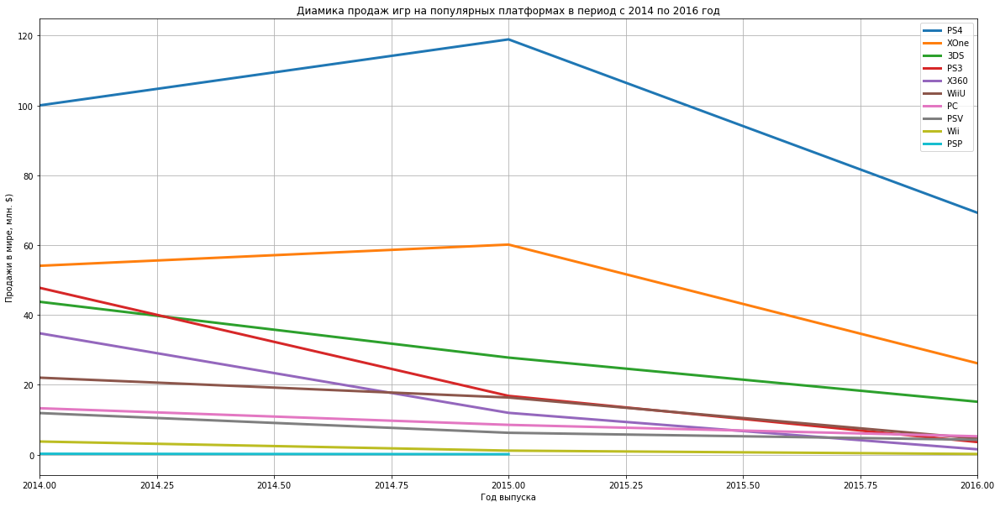
    


<div class="alert alert-block alert-danger">
<h2> Комментарий ревьюера <a class="tocSkip"></h2>

    
<b>На доработку🤔:</b> 
    
Сергей, на данном шаге очень важно выбрать актуальный период, причем как можно более ранний, поскольку резкий спад популярности платформы может произойти за 3-4 года. Если ты посмотришь на продажи игр по отдельности с помощью, например, столбчатой диаграммы, ты увидишь, что лидером по продажам за всю историю PS2. Но продажи к 2011 году уже нулевые. X360 был на пике в 2010, но к 2016 упал почти до 0. Та же ситуация с PS3: к 2016 г. продажи стремятся к нулю, у Wii продажи нулевые уже в 2015 г.  Соответственно, если мы выбираем более длинный период, мы рискуем захватить отстающий тренд, т.е. включаем в данные неактуальные платформы предпериода, которые не должны оставаться в данных для предсказываемом периоде. Outdated платформы лучше исключить из анализа, так как они будут искажать итоговые результаты, вносить устаревший тренд.
    
2010 г. - не совсем корректная нижняя граница для актуального периода, попробуй выбрать более поздний год, чтобы не захватывать устаревшие тенденции.
    
В качестве нижней границы актуального периода лучше использовать 2012 или 2013 год, вполне допустимо использовать 2014, включая 2014 г.,  Год, который можно считать границей текущего периода, можно определить путем построения гистограмм для каждой платформы. Гистограммы покажут, что игры теряют актуальность в течение 3-4, максимум 5 лет, при этом срок жизни платформы в среднем около 10 лет. Последним годом набора данных является 2016 год, поэтому мы вычитаем 3-4 года из 2016 и получаем год, который можно считать границей текущего периода.
    
Помни, что глобальная цель этого проекта - ПРОГНОЗ продаж, популярности, прибыльности платформ, поэтому нам нужно анализировать не прошлое, а настоящее и будущее. См. Инструкцию:
    
`Перед вами данные до 2016 года. Представим, что сейчас декабрь 2016 г., и вы планируете кампанию на 2017-й. Нужно отработать принцип работы с данными. Неважно, прогнозируете ли вы продажи на 2017 год по данным 2016-го или же 2027-й — по данным 2026 года.`
    
P.S. Очень важно, выбрав актуальный период, не анализировать отмирающие платформы, такие как "PS3", "X360", "Wii", "PSP".

<div class="alert alert-block alert-info">
    
**Добрботка студента**
    
- исправлен временной интервал</div>

<div class="alert alert-success">
<h2> Комментарий ревьюера: вторая итерация ревью <a class="tocSkip"> </h2>

<b>Все отлично!👍</b> 
    
Хорошо, теперь нижняя граница актуального периода выбрана более корректно!


```python
relevant_games.boxplot(by='platform', column=['total_sales'], grid=True, figsize=(20, 10), showfliers=False);
plt.title('Распределение выручки от продаж игр на популярных платформах в период с 2014 по 2016 год');
plt.xlabel('Платформа');
plt.ylabel('Продажи в мире, млн. $)');
plt.show();
```


    

    


**Выводы**: 

- На графике видена четкая дата перелома уровня популярности платформ - середина 2013 года. К этому моменту большинство игровых платформ уходит на спад, и начинают набирать популярность 2 новые - PS4 и XOne. Видно далее, что пик их попурярности пришкелся на 2015 год. С учетом жизненного цикла платформ в 6-10 лет можно рассматривать эти 2 платформы как основу для распространения игры

- В целом тренд компьютерных игр ослабевает - новые платформы не набирают таких продаж, как раньше (60-120 млн. USD против 175+ млн USD)

- Медианые значения продаж по популярным платформам находятся в диапазоне от 0,1 до 0,2 млн. USD 

- Верхняя граница продаж у платформ PS4 и XOne - 1,5 млн. USD.

- Для получения прогнозов на 2017 год будем брать период с 2014-2016 год, так как в этом периоде представлены наиболее актуальные платформы - PS4 и XOne

<div class="alert alert-warning">
    <h2> Комментарий ревьюера <a class="tocSkip"> </h2>
    
<b>Некоторые замечания и рекомендации💡:</b> 
        
Твоя логика в целом верна, но стоит перестроить график, уточнив нижнюю границу актуального периода!

<div class="alert alert-block alert-info">
    
**Добрботка студента**
    
- исправлены графики</div>

<div class="alert alert-success">
<h2> Комментарий ревьюера: вторая итерация ревью <a class="tocSkip"> </h2>

<b>Все отлично!👍</b> 

<a id='section4.4'></a>
### Анализ влияния отзывов пользователей и критиков на продажи игр

#### Оценка влияния отзывов пользователей и критиков на продажи игр на платформе PS4


```python
games_ps4 = relevant_games.query('platform == "PS4"')

#вычисление корреляций
print('Коэффициент линейной корреляции между продажами игр на платформ PS4 и оценкой пользователей:', round(
    games_ps4['total_sales'].corr(games_ps4['user_score']),4))
print('\nКоэффициент линейной корреляции между продажами игр на платформ PS4 и оценкой критиков:', round(
    games_ps4['total_sales'].corr(games_ps4['critic_score']),4))


#построение диаграмм рассеяния
fig, (ax1,ax2) = plt.subplots(1,2,figsize=(20,5));

ax1.scatter(data = games_ps4, x = 'user_score', y = 'total_sales');
ax1.set_title('Диаграмма рассеяния для оценки пользователей и игр на PS4');
ax1.set_xlabel('Оценка пользователей');
ax1.set_ylabel('Продажи в мире, млн. $');

ax2.scatter(data = games_ps4, x = 'critic_score', y = 'total_sales');
ax2.set_title('Диаграмма рассеяния для оценки критиков и игр на PS4');
ax1.set_xlabel('Продажи в мире, млн. $');
```

    Коэффициент линейной корреляции между продажами игр на платформ PS4 и оценкой пользователей: -0.0401
    
    Коэффициент линейной корреляции между продажами игр на платформ PS4 и оценкой критиков: 0.4027


    
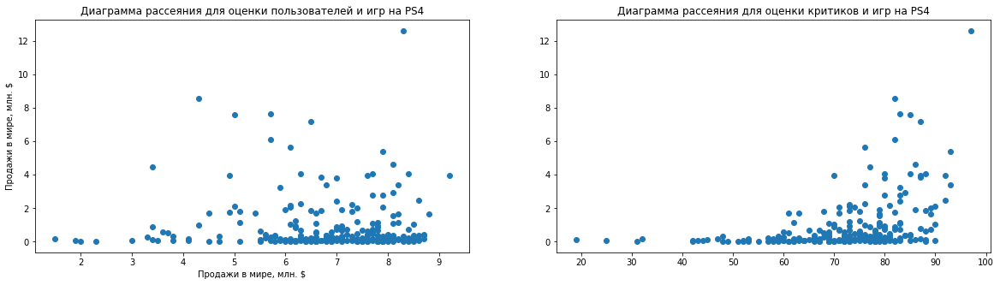
    


#### Оценка влияния отзывов пользователей и критиков на продажи игр на остальных платформах


```python
games_non_ps4 = relevant_games.query('platform != "PS4"')

#вычисление корреляций
print('Коэффициент линейной корреляции между продажами игр на остальных платформах и оценкой пользователей:', round(
    games_non_ps4['total_sales'].corr(games_non_ps4['user_score']),4))
print('\nКоэффициент линейной корреляции между продажами игр на остальных платформах и оценкой критиков:', round(
    games_non_ps4['total_sales'].corr(games_non_ps4['critic_score']),4))


#построение диаграмм рассеяния
fig, (ax1,ax2) = plt.subplots(1,2,figsize=(20,5));

ax1.scatter(data = games_non_ps4, x = 'user_score', y = 'total_sales');
ax1.set_title('Диаграмма рассеяния для оценки пользователей и игр на остальных платформах');
ax1.set_xlabel('Оценка пользователей');
ax1.set_ylabel('Продажи в мире, млн. $');

ax2.scatter(data = games_non_ps4, x = 'critic_score', y = 'total_sales');
ax2.set_title('Диаграмма рассеяния для оценки критиков и игр на остальных платформах');
ax1.set_xlabel('Продажи в мире, млн. $');
```

    Коэффициент линейной корреляции между продажами игр на остальных платформах и оценкой пользователей: -0.0235
    
    Коэффициент линейной корреляции между продажами игр на остальных платформах и оценкой критиков: 0.3095


    
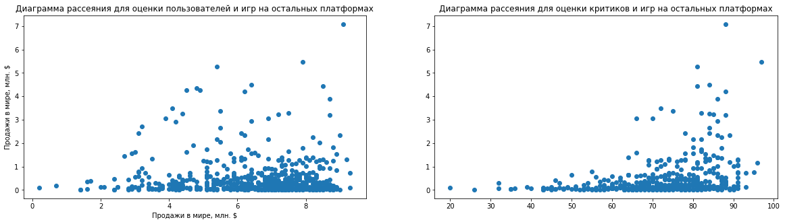
    


**Выводы**

Из диаграмм рассеяния и коэффициентов линейной корреляции видно, что:

- Зависимость между продажами и отзывами пользователей отсутствует
- Зависимость между продажами и отзывами критиков довольно сильная (корреляция около 0.4 для PS4 и около 0.3 для остальных платформ)

<div class="alert alert-success">
<h2> Комментарий ревьюера  <a class="tocSkip"> </h2>

<b>Все отлично!👍:</b> 

Согласна с твоей интерпретацией результатов корреляционного анализа.

<a id='section4.5'></a>
### Анализ жанров игр


```python
relevant_games.boxplot(by='genre', column=['total_sales'], grid=True, figsize=(20, 10), showfliers=False);
plt.title('Распределение выручки от жанра игр на популярных платформах в период с 2014 по 2016 год');
plt.xlabel('Жанр');
plt.ylabel('Продажи в мире, млн. $)');
plt.show();
```


    
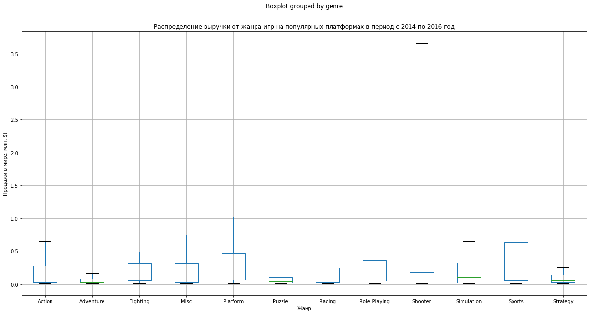
    


**Выводы:**

- наиболее прибыльные жанры - Shooter, Sports, Platform.

- наименее прибыльные - Puzzle, Adventure, Strategy


Такое распределение продаж может быть связано с тратами на производство игр. Для жанров Shooter и Sports требуется больше ресурсов, соответственно и продажи должны быть выше.

<div class="alert alert-success">
<h2> Комментарий ревьюера : вторая итерация ревью <a class="tocSkip"> </h2>

<b>Все отлично!👍:</b> 

Твои выводы верны, все получилось!

<a id='section4.6'></a>
### Выводы четвертого раздела


- Для получения прогнозов на 2017 год будем брать период с 2014-2016 год, так как в этом диапазоне представлены как популярные платформы, так и новые, которые в скором времени выйдут на пик популярности. Более ранние игры в среднем уже утратили свою актуальность и вряд ли помогут в планировании кампании на 2017 год. 

- Обычно платформам требуется несколько лет (2-4), чтобы выйти на пик популярности. Среднее "время жизни" платформ находится в диапазоне 6-10 лет.

- К середине 2013 года большинство игровых платформ уходит на спад, и начинают набирать популярность 2 новые - PS4 и XOne. Видно далее, что пик их попурярности пришкелся на 2015 год. С учетом жизненного цикла платформ в 6-10 лет можно рассматривать эти 2 платформы как основу для распространения игры

- В целом тренд компьютерных игр ослабевает - новые платформы не набирают таких продаж, как раньше (60-120 млн. USD против 175+ млн USD). Медианые значения продаж по популярным платформам находятся в диапазоне от 0,1 до 0,2 млн. USD. Верхняя граница продаж у платформ PS3 и XOne - 1,5 млн. USD.

- Зависимость между продажами и отзывами пользователей отсутствует, а зависимость между продажами и отзывами критиков довольно сильная (корреляция около 0.4 для PS4 и около 0.3 для остальных платформ)

- Наиболее прибыльные жанры - Shooter, Sports, Platform. Наименее прибыльные -Puzzle, Adventure, Strategy. Такое распределение продаж может быть связано с тратами на производство игр. Для жанров Shooter и Sports требуется больше ресурсов, соответственно и продажи должны быть выше.


<a id='section5'></a>
## Составление портрета пользователя каждого региона

<a id='section5.1'></a>
### Определение самых популярных платформ в заданных регионах


```python
# топ 5 платформ регионов NA, EU, JP
top_na_platform = round(relevant_games.groupby(['platform'])['na_sales'].sum().sort_values(ascending=False).head(),2).to_dict()
top_eu_platform = round(relevant_games.groupby(['platform'])['eu_sales'].sum().sort_values(ascending=False).head(),2).to_dict()
top_jp_platform = round(relevant_games.groupby(['platform'])['jp_sales'].sum().sort_values(ascending=False).head(),2).to_dict()

#построение диаграмм
fig, (ax1,ax2,ax3) = plt.subplots(1,3, figsize=(20,5));

ax1.pie(top_na_platform.values(), labels = top_na_platform.values());
ax1.legend(top_na_platform.keys(), bbox_to_anchor=(1, 0, 0, 1));
ax1.set_title('Топ-5 платформ региона NA');

ax2.pie(top_eu_platform.values(), labels = top_eu_platform.values());
ax2.legend(top_eu_platform.keys(), bbox_to_anchor=(1, 0, 0, 1));
ax2.set_title('Топ-5 платформ региона EU');

ax3.pie(top_jp_platform.values(), labels = top_jp_platform.values());
ax3.legend(top_jp_platform.keys(), bbox_to_anchor=(1, 0, 0, 1));
ax3.set_title('Топ-5 платформ региона JP');
```


    
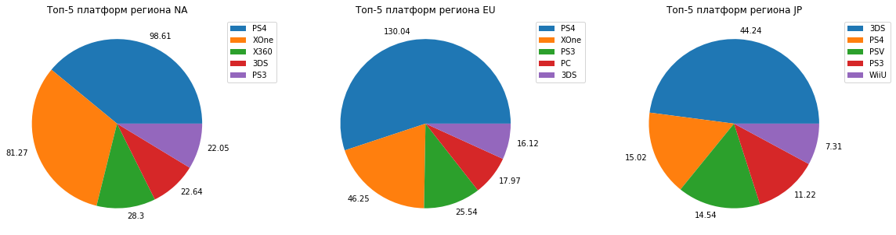
    


**Выводы:** 

- Для регионов NA и EU лидирующая платформа это PS4, для JP - 3DS

- Для региона NA платформа XOne (вторая по популярности) лишь немного уступает PS4

- Во всех регионах в топ-3 присутствует платформа PS4

<div class="alert alert-warning">
    <h2> Комментарий ревьюера <a class="tocSkip"> </h2>
    
<b>Некоторые замечания и рекомендации💡:</b> 
        
Не совсем точные выводы на данном шаге! Стоит скорректировать актуальный период и перепроверить результаты👀

<div class="alert alert-block alert-info">
    
**Добрботка студента**
    
- исправлены выводы</div>

<div class="alert alert-success">
<h2> Комментарий ревьюера: вторая итерация ревью <a class="tocSkip"> </h2>

<b>Все отлично!👍</b> 
    
Да, теперь твои выводы верны, все получилось!

<a id='section5.2'></a>
### Определение самых популярных жанров в заданных регионах


```python
# топ 5 жанров регионов NA, EU, JP
top_na_genre = round(relevant_games.groupby(['genre'])['na_sales'].sum().sort_values(ascending=False).head(),2).to_dict()
top_eu_genre = round(relevant_games.groupby(['genre'])['eu_sales'].sum().sort_values(ascending=False).head(),2).to_dict()
top_jp_genre = round(relevant_games.groupby(['genre'])['jp_sales'].sum().sort_values(ascending=False).head(),2).to_dict()

#построение диаграмм
fig, (ax1,ax2,ax3) = plt.subplots(1,3, figsize=(20,5));

ax1.pie(top_na_genre.values(), labels = top_na_genre.values());
ax1.legend(top_na_genre.keys(), bbox_to_anchor=(1, 0, 0, 1));
ax1.set_title('Топ-5 жанров региона NA');

ax2.pie(top_eu_genre.values(), labels = top_eu_genre.values());
ax2.legend(top_eu_genre.keys(), bbox_to_anchor=(1, 0, 0, 1));
ax2.set_title('Топ-5 жанров региона EU');

ax3.pie(top_jp_genre.values(), labels = top_jp_genre.values());
ax3.legend(top_jp_genre.keys(), bbox_to_anchor=(1, 0, 0, 1));
ax3.set_title('Топ-5 жанров региона JP');
```


    

    


**Выводы:** 

- Регионы NA и EU имеют практически схожее распределение по популярности жанров - в топе Action, Shooter, Sports. 

- Регион JP немного отличается - здесь в топе Role-Player, лишь потом Action. Жанр Sports отсутствует, зато присутствует жанр Fighting, который не представлен в других регионах.

- Во всех регионах в топ-2 присутствует жанр Action

<div class="alert alert-success">
<h2> Комментарий ревьюера <a class="tocSkip"> </h2>

<b>Все отлично!👍:</b> 
    
Да, в данном случае - Япония как отдельный кейс для исследования:)

<a id='section5.3'></a>
### Анализ влияния рейтинга ESRB на продажи в отдельном регионе


```python
# топ 5 рейтингов регионов NA, EU, JP
top_na_rating = round(relevant_games.groupby(['rating'])['na_sales'].sum().sort_values(ascending=False).head(),2).to_dict()
top_eu_rating = round(relevant_games.groupby(['rating'])['eu_sales'].sum().sort_values(ascending=False).head(),2).to_dict()
top_jp_rating = round(relevant_games.groupby(['rating'])['jp_sales'].sum().sort_values(ascending=False).head(),2).to_dict()

#построение диаграмм
fig, (ax1,ax2,ax3) = plt.subplots(1,3, figsize=(20,5));

ax1.pie(top_na_rating.values(), labels = top_na_rating.values());
ax1.legend(top_na_rating.keys(), bbox_to_anchor=(1, 0, 0, 1));
ax1.set_title('Топ-5 рейтингов региона NA');

ax2.pie(top_eu_rating.values(), labels = top_eu_rating.values());
ax2.legend(top_eu_rating.keys(), bbox_to_anchor=(1, 0, 0, 1));
ax2.set_title('Топ-5 рейтингов региона EU');

ax3.pie(top_jp_rating.values(), labels = top_jp_rating.values());
ax3.legend(top_jp_rating.keys(), bbox_to_anchor=(1, 0, 0, 1));
ax3.set_title('Топ-5 рейтингов региона JP');
```


    
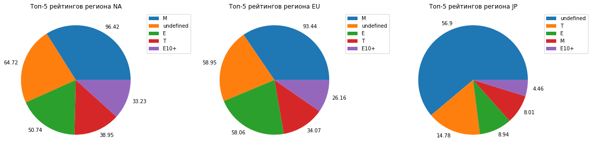
    


**Выводы:** 

- Регионы EU и NA имеют одинаковое распределение по рейтингам игр - в топе M(Mature), без рейтинга, E(Everyone).

- Регион JP содержит те же рейтинги, но в другом порядке - без рейтинга, T(Teen), M(Mature). 

- Возможно в Японии и других регионах свои рейтинговые системы, которая не представлена в выборке. Таким образом и появляются игра 'без рейтинга' в регионе

<div class="alert alert-warning">
    <h2> Комментарий ревьюера <a class="tocSkip"></h2>
    
<b>Некоторые замечания и рекомендации💡:</b> 

Сергей, важно проанализировать игры, которые не имеют рейтинга.

Если не брать во внимание игры без рейтинга, огромная часть игр просто выпадает из анализа. И на этом этапе важно найти способ учитывать такие игры. (в одном из комментариев выше я предлагаю заменить пропуски в этой колонке на "неизвестен")

<div class="alert alert-block alert-info">
    
**Добрботка студента**
    
- добавлена информация об играх без рейтинга</div>

<div class="alert alert-success">
<h2> Комментарий ревьюера: вторая итерация ревью <a class="tocSkip"> </h2>

<b>Все отлично!👍</b> 
    
Вижу твои коррективы, все получилось!

<a id='section5.4'></a>
### Выводы пятого раздела

- Для регионов NA и EU лидирующая платформа это PS4, для JP - 3DS. Во всех регионах в топ-3 присутствует платформа PS4

- Регионы NA и EU имеют практически схожее распределение по популярности жанров - в топе Action, Shooter, Sports. Регион JP немного отличается - здесь в топе Role-Player, лишь потом Action. Жанр Sports отсутствует, зато присутствует жанр Fighting, который не представлен в других регионах. Во всех регионах в топ-2 присутствует жанр Action

- Регионы EU и NA имеют одинаковое распределение по рейтингам игр - в топе M(Mature), без рейтинга, E(Everyone). Регион JP содержит те же рейтинги, но в другом порядке - без рейтинга, T(Teen), M(Mature). Возможно в Японии и других регионах свои рейтинговые системы, которая не представлена в выборке. Таким образом и появляются игра 'без рейтинга' в регионе


**На основе данного анализа и описания рейтинга ESRB можно сформировать портреты типичного игрока каждого региона:**


- NA: возраст 17+, предпочитает жанры Action/Shooter, играет на платформе PS4/XOne

- EU: возраст 17+, предпочитает жанры Shooter/Action, играет на платформе PS4

- JP: возраст 13+, предпочитает жанры Role-Playing/Action, играет на платформе 3DS


<a id='section6'></a>
## Проверка статистических гипотез

Для проверки гипотез раздела используется t-критерий Стьюдента, так как сравниваемые выборки независимы между собой.

<a id='section6.1'></a>
### Гипотеза 1. Средние пользовательские рейтинги платформ Xbox One и PC одинаковые

Сформулированные гипотезы:

- H0: Средние пользовательские рейтинги платформ Xbox One и PC одинаковые
- H1: Средние пользовательские рейтинги платформ Xbox One и PC отличаются

<div class="alert alert-success">
<h2> Комментарий ревьюера <a class="tocSkip"> </h2>

<b>Все отлично!👍:</b> 
    
Нулевая и альтернативная гипотезы сформулированы корректно, так держать!


```python
data_1 = relevant_games.loc[relevant_games['platform']=='XOne', 'user_score'].dropna()
data_2 = relevant_games.loc[relevant_games['platform']=='PC', 'user_score'].dropna()
alpha = 0.05

#оцениваем разницу дисперсий выборок
print('Абсолютные значения дисперсий пользовательских рейтингов платформ тарифов XOne и PC:', [np.var(x, ddof=1) for x in [data_1, data_2]])
print('\np-value для дисперсий пользовательских рейтингов платформ тарифов XOne и PC:', levene(data_1, data_2, center = 'mean').pvalue,'\n')

if (levene(data_1, data_2).pvalue < alpha):
    print('Вывод: дисперсии выборок различаются значительно. Для проверки гипотезы используем параметр equal_var = False')
else:
    print('Вывод: дисперсии выборок не различаются значительно. Для проверки гипотезы используем параметр equal_var = True')
```

    Абсолютные значения дисперсий пользовательских рейтингов платформ тарифов XOne и PC: [1.8910066518847013, 2.901154315133451]
    
    p-value для дисперсий пользовательских рейтингов платформ тарифов XOne и PC: 0.004386298510089398 
    
    Вывод: дисперсии выборок различаются значительно. Для проверки гипотезы используем параметр equal_var = False


```python
results = st.ttest_ind(
    data_1,
    data_2,
    equal_var = False)

print('p-value:', results.pvalue)

if (results.pvalue < alpha):
    print('Отвергаем нулевую гипотезу')
else:
    print('Не удалось отвергнуть нулевую гипотезу')
```

    p-value: 0.11601398086668827
    Не удалось отвергнуть нулевую гипотезу


**Вывод: средние пользовательские рейтинги платформ Xbox One и PC одинаковые**

<a id='section6.2'></a>
### Гипотеза 2. Средние пользовательские рейтинги жанров Action и Sports разные

Сформулированные гипотезы:

- H0: Средние пользовательские рейтинги жанров Action и Sports одинаковые
- H1: Средние пользовательские рейтинги жанров Action и Sports отличаются


```python
data_3 = relevant_games.loc[relevant_games['genre']=='Action', 'user_score'].dropna()
data_4 = relevant_games.loc[relevant_games['genre']=='Sports', 'user_score'].dropna()
alpha = 0.05

#оцениваем разницу дисперсий выборок
print('Абсолютные значения дисперсий пользовательских рейтингов жанров Action и Sports:', [np.var(x, ddof=1) for x in [data_1, data_2]])
print('\np-value для дисперсий пользовательских рейтингов платформ жанров Action и Sports:', levene(data_1, data_2, center = 'mean').pvalue,'\n')

if (levene(data_1, data_2).pvalue < alpha):
    print('Вывод: дисперсии выборок различаются значительно. Для проверки гипотезы используем параметр equal_var = False')
else:
    print('Вывод: дисперсии выборок не различаются значительно. Для проверки гипотезы используем параметр equal_var = True')
```

    Абсолютные значения дисперсий пользовательских рейтингов жанров Action и Sports: [1.8910066518847013, 2.901154315133451]
    
    p-value для дисперсий пользовательских рейтингов платформ жанров Action и Sports: 0.004386298510089398 
    
    Вывод: дисперсии выборок различаются значительно. Для проверки гипотезы используем параметр equal_var = False


```python
results = st.ttest_ind(
    data_3,
    data_4,
    equal_var = False)

print('p-value:', results.pvalue)

if (results.pvalue < alpha):
    print('Отвергаем нулевую гипотезу')
else:
    print('Не удалось отвергнуть нулевую гипотезу')
```

    p-value: 1.1825550382644557e-14
    Отвергаем нулевую гипотезу


**Вывод: средние пользовательские рейтинги жанров Action и Sports отличаются**

<div class="alert alert-success">
<h2> Комментарий ревьюера <a class="tocSkip"> </h2>

<b>Все отлично!👍:</b> 
    
Ты успешно реализовал тестирование гипотез, здорово, что ты проверил дисперсии на гомогенность, используя тест Левена, все получилось, хорошая работа!

<a id='section6.3'></a>
### Выводы шестого раздела

Была проведена проверка гипотез. Установлено, что:

1. Средние пользовательские рейтинги платформ Xbox One и PC одинаковые
2. Средние пользовательские рейтинги жанров Action и Sports отличаются

<a id='section7'></a>
## Общие выводы проекта

В проекте ставилась задача выявления закономерностей успешных игр на основе исторических данных для планирования рекламных кампаний на следующий год. В данных содержалась информация о продажах игр, оценках пользователей и экспертов, жанрах, рейтингах и платформах. 

Для получения прогнозов на 2017 год был взят период с 2014-2016 год, так как в этом диапазоне представлены как популярные платформы, так и новые, которые в скором времени выйдут на пик популярности. Более ранние игры в среднем уже утратили свою актуальность и вряд ли помогут в планировании кампании на 2017 год. 

Результаты анализа следующие:

**1. Общие тренды игровой индустрии**

- Обычно платформам требуется несколько лет (2-4), чтобы выйти на пик популярности. Среднее "время жизни" платформ находится в диапазоне 6-10 лет. С учетом этого можно рассматривать платформы PS4 и XOne как основу для распространения игры в 2017 году.

- В целом тренд компьютерных игр ослабевает - новые платформы не набирают таких продаж, как раньше (60-120 млн. USD против 175+ млн USD).

- Зависимость между продажами и отзывами пользователей отсутствует, а зависимость между продажами и отзывами критиков довольно сильная (корреляция около 0.4 для PS4 и около 0.3 для остальных платформ). 

- Наиболее прибыльные жанры - Shooter, Sports, Platform. Наименее прибыльные -Puzzle, Adventure, Strategy. Это стоит учитывать при планировании бюджета на маркетинг.

- Средние пользовательские рейтинги платформ Xbox One и PC одинаковые

- Средние пользовательские рейтинги жанров Action и Sports отличаются

**2. Тренды регионов**

- Для регионов NA и EU лидирующая платформа это PS4, для JP - 3DS. Во всех регионах в топ-3 присутствует платформа PS4

- Регионы NA и EU имеют практически схожее распределение по популярности жанров - в топе Action, Shooter, Sports. Регион JP немного отличается - здесь в топе Role-Player, лишь потом Action. Жанр Sports отсутствует, зато присутствует жанр Fighting, который не представлен в других регионах. Во всех регионах в топ-2 присутствует жанр Action

- Регионы EU и NA имеют одинаковое распределение по рейтингам игр - в топе M(Mature), без рейтинга, E(Everyone). Регион JP содержит те же рейтинги, но в другом порядке - без рейтинга, T(Teen), M(Mature). Возможно в Японии и других регионах свои рейтинговые системы, которая не представлена в выборке. Таким образом и появляются игра 'без рейтинга' в регионе

**3. Портрет пользователей игр по регионам**

- NA: возраст 17+, предпочитает жанры Action/Shooter, играет на платформе PS4/XOne

- EU: возраст 17+, предпочитает жанры Shooter/Action, играет на платформе PS4

- JP: возраст 13+, предпочитает жанры Role-Playing/Action, играет на платформе 3DS

<div class="alert alert-block alert-info">
    
**Добрботка студента**
    
- обновлены финальные выводы</div>

<div class="alert alert-success">
<h2> Комментарий ревьюера: вторая итерация ревью <a class="tocSkip"> </h2>

<b>Все отлично!👍</b> 

<div style="border:solid Chocolate 2px; padding: 40px">

**Общий вывод по проекту**

Сергей, спасибо за твой проект! Ты приложил много усилий, чтобы довести его до конца, все задачи в рамках проекта тебе удалось успешно решить, это видно невооруженным глазом, отличная работа! Однако, есть несколько важных моментов, которые стоит улучшить, чтобы проект стал действительно идеальным!

**Отмечу отдельные положительные моменты проекта🙂**:
* Отдельный плюс - твой подход к оформлению  шагов анализа и самого кода, твой проект было приятно читать и проверять!
* На разных шагах проекта ты предлагал очень интересные решения и методы для их реализации. Хорошая работа!
* Ты активно работал с визуализацией, хорошо, что ты не избегаешь этого инструмента для анализа и используешь его на полную! 
* Ты использовал разные методы для работы с данными, круто, что ты владеешь ими и можешь применять на практике.
* Здорово, что ты использовал автоматизацию для работы с данными, это хорошая практика программирования!

    
**На что стоит обратить внимание:🙂**:

* На всех шагах анализа важно использовать только актуальный временной срез.
* Стоит добавить анализ игр без рейтинга, для этого обрати еще раз внимание на стратегию обработки пропусков в этой колонке
    
**Желаю удачи и жду твой проект на повторное ревью!**😉
    


<div style="border:solid Chocolate 2px; padding: 40px">

**Общий вывод по проекту: вторая итерация ревью**

Сергей, спасибо, что прислал проект с доработками (и отдельное спасибо за обратную связь)! Тебе удалось значительно улучшить проект, спасибо за терпение и желание довести проект до конца, у тебя все отлично получается, дальше - больше и лучше!
Спешу тебе сообщить, что твой проект принят, и ты можешь перейти на следующий спринт!

**Желаю тебе крутых и интересных проектов на следующих спринтах**😉


```python

```
