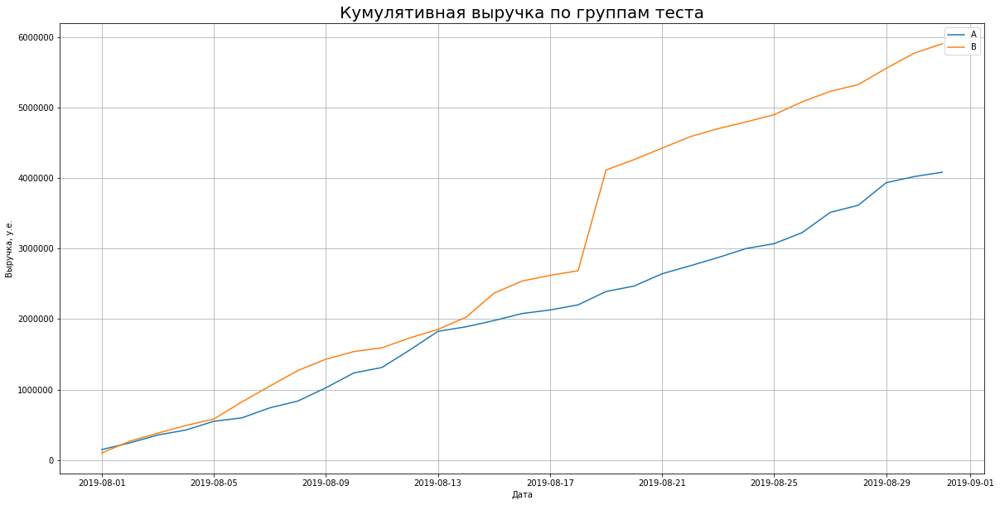
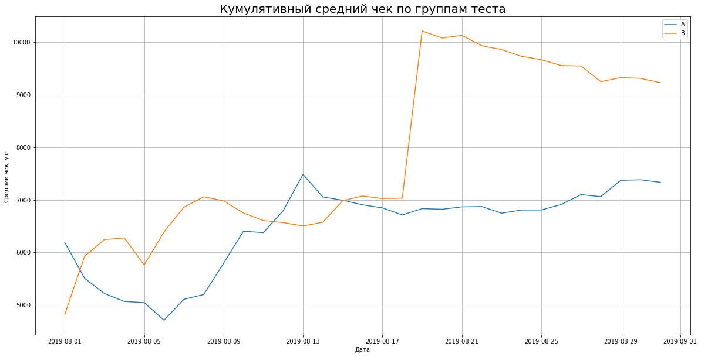
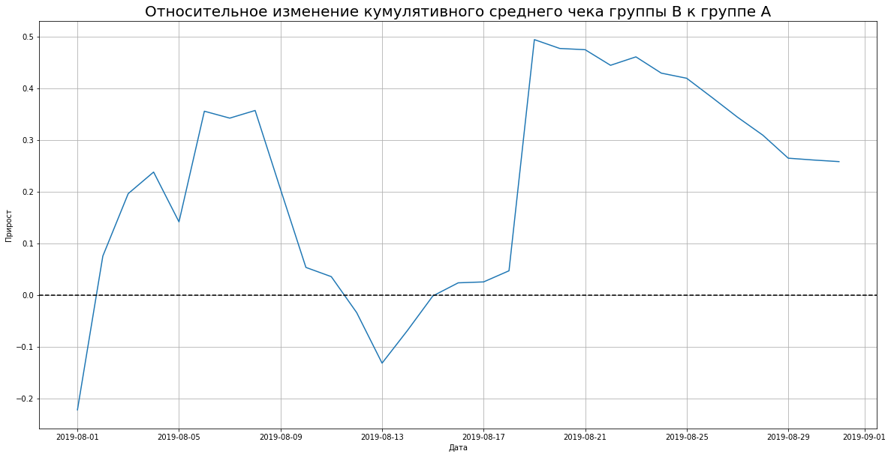
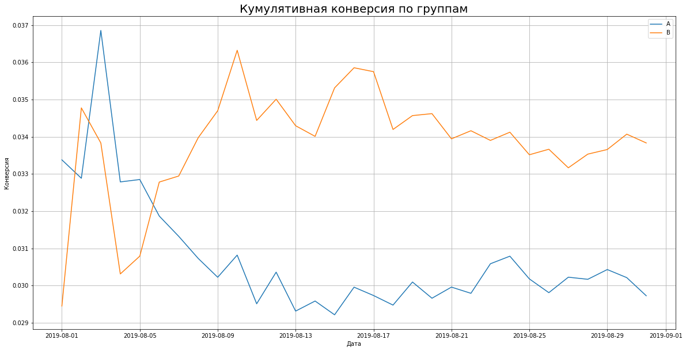
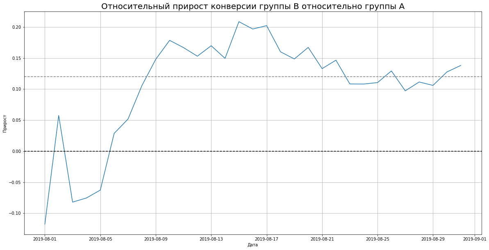
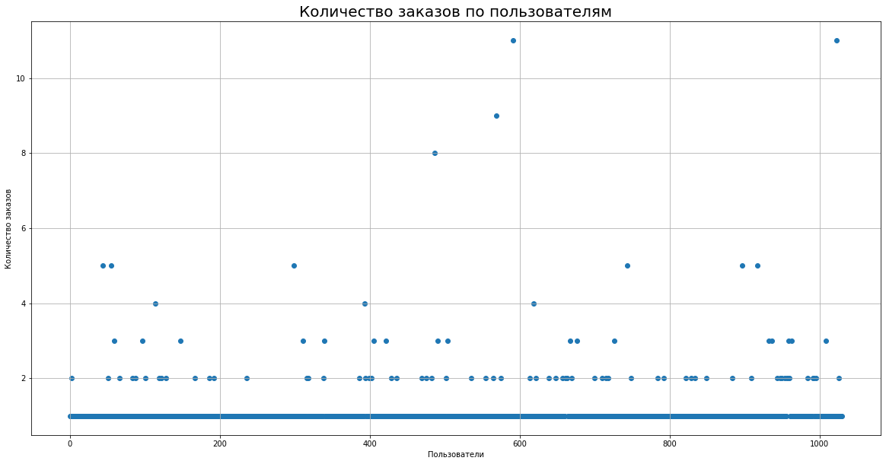
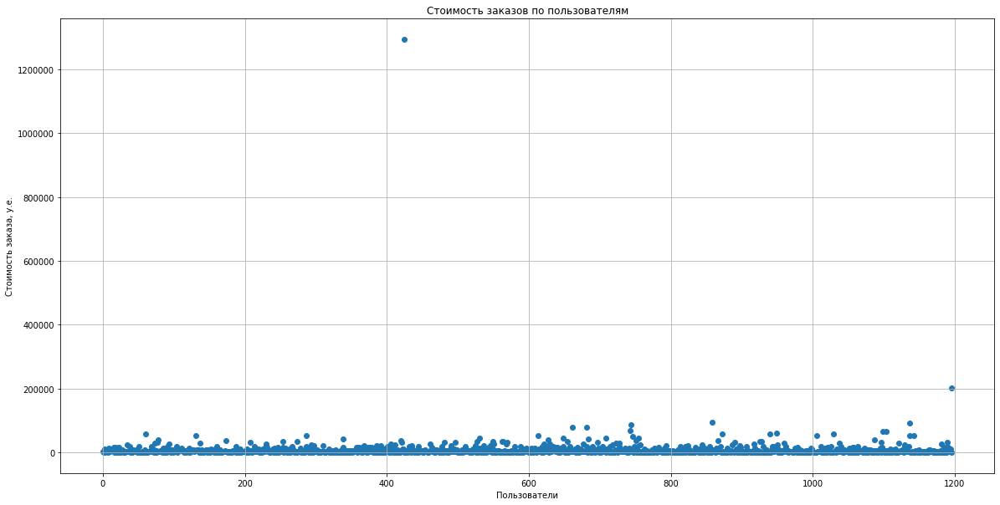

# Проект №3 Тестирование гипотез в маркетинге

# Оглавление
1. [Введение](#section1)
    * [Описание проекта](#section1.1)
    * [Описание данных](#section1.2)


2. [Изучение общей информации о наборе данных](#section2)
    * [Обзор датасета](#section2.1)
    * [Выводы второго раздела](#section2.2)

    
    
3. [Приоритизация гипотез](#section3)
    * [Применение фреймворка ICE для приоритизации гипотез](#section3.1)
    * [Применение фреймворка RICE для приоритизации гипотез](#section3.2)  
    * [Выводы четвертого раздела](#section3.3)
    
    
4. [Анализ A/B-теста](#section4)
    * [График кумулятивной выручки по группам](#section4.1)
    * [График кумулятивного среднего чека по группам](#section4.2)
    * [График относительного изменения кумулятивного среднего чека группы B к группе A](#section4.3)
    * [График кумулятивной конверсии по группам](#section4.4) 
    * [График относительного изменения кумулятивной конверсии группы B к группе A](#section4.5) 
    * [Точечный график количества заказов по пользователям](#section4.6)     
    * [Расчет 95-й и 99-й перцентилей количества заказов на пользователя](#section4.7) 
    * [Точечный график стоимостей заказов](#section4.8) 
    * [Расчет 95-й и 99-й перцентилей стоимости заказов](#section4.9) 
    * [Расчет статистической значимости различий в конверсии между группами по «сырым» данным](#section4.10) 
    * [Расчет статистической значимости различий в среднем чеке заказа между группами по «сырым» данным](#section4.11) 
    * [Расчет статистической значимости различий в конверсии между группами по «очищенным» данным](#section4.12) 
    * [Расчет статистической значимости различий в среднем чеке заказа между группами по «очищенным» данным](#section4.13)
    * [Принятие решений на основе результатов A/B теста](#section4.14)
    
    
6. [Общие выводы проекта](#section5)   

<a id='section1'></a>
## Введение

<a id='section1.1'></a>
### Описание проекта

Вы — аналитик крупного интернет-магазина. Вместе с отделом маркетинга вы подготовили список гипотез для увеличения выручки.


**Требуется:**

1. приоритизировать гипотезы
2. запустить A/B-тест
3. проанализируйте результаты.


<a id='section1.2'></a>
### Описание данных

**Датасет 1**
- /datasets/hypothesis.csv - набор гипотез для тестирования

Структура hypothesis.csv

- Hypothesis — краткое описание гипотезы;
- Reach — охват пользователей по 10-балльной шкале;
- Impact — влияние на пользователей по 10-балльной шкале;
- Confidence — уверенность в гипотезе по 10-балльной шкале;
- Efforts — затраты ресурсов на проверку гипотезы по 10-балльной шкале. Чем больше значение Efforts, тем дороже проверка гипотезы.

**Датасет 2**
- /datasets/orders.csv - информация о заказах

Структура orders.csv

- transactionId — идентификатор заказа;
- visitorId — идентификатор пользователя, совершившего заказ;
- date — дата, когда был совершён заказ;
- revenue — выручка заказа;
- group — группа A/B-теста, в которую попал заказ.

**Датасет 3**
- /datasets/visitors.csv — информация о посетителях

Структура visitors.csv

- date — дата;
- group — группа A/B-теста;
- visitors — количество пользователей в указанную дату в указанной группе A/B-теста


<a id='section2'></a>
## Изучение общей информации о наборе данных

**Импорт библиотек**


```python
import pandas as pd
import scipy.stats as stats
import seaborn as sns
import matplotlib.pyplot as plt
import numpy as np

import warnings
warnings.filterwarnings('ignore')
```

<a id='section2.1'></a>
### Обзор датасетов


```python
#Загрузка таблиц
hypothesis = pd.read_csv('/datasets/hypothesis.csv')
orders = pd.read_csv('/datasets/orders.csv', parse_dates=['date'])
visitors = pd.read_csv('/datasets/visitors.csv', parse_dates=['date'])

#Фуекция обзора таблиц
def review_dataset(dataset):
    try:
        print('\033[1m','Случайные 10 строк таблицы:','\033[0m')
        display(dataset.sample(10))
        print('\033[1m','Информация о типах данных:\n', '\033[0m')
        print(dataset.info(),'\n')
        print('\033[1m', 'Доля пропусков в столбцах:\n', '\033[0m')
        report = dataset.isna().sum().to_frame()
        report = report.rename(columns = {0: 'missing_values'})
        report['% of total'] = (100*(report['missing_values'] / dataset.shape[0])).astype(int)
        report.sort_values(by = 'missing_values', ascending = False)
        display(report)
        print('\033[1m', '\nКоличество дубликатов:', '\033[0m', dataset.duplicated().sum(),'\n')
        print('\033[1m', 'Характерные значения:\n', '\033[0m')
        display(dataset.describe())
    except:
        print('Ошибка просмотра данных. Проверьте корректность изучаемого датасета')
```


#### Обзор таблицы **hypothesis**


```python
hypothesis.columns = hypothesis.columns.str.lower()
pd.set_option("max_colwidth", 0)
display(hypothesis)
hypothesis.info()
```


</style>
<table border="1" class="dataframe">
  <thead>
    <tr style="text-align: right;">
      <th></th>
      <th>hypothesis</th>
      <th>reach</th>
      <th>impact</th>
      <th>confidence</th>
      <th>efforts</th>
    </tr>
  </thead>
  <tbody>
    <tr>
      <td>0</td>
      <td>Добавить два новых канала привлечения трафика, что позволит привлекать на 30% больше пользователей</td>
      <td>3</td>
      <td>10</td>
      <td>8</td>
      <td>6</td>
    </tr>
    <tr>
      <td>1</td>
      <td>Запустить собственную службу доставки, что сократит срок доставки заказов</td>
      <td>2</td>
      <td>5</td>
      <td>4</td>
      <td>10</td>
    </tr>
    <tr>
      <td>2</td>
      <td>Добавить блоки рекомендаций товаров на сайт интернет магазина, чтобы повысить конверсию и средний чек заказа</td>
      <td>8</td>
      <td>3</td>
      <td>7</td>
      <td>3</td>
    </tr>
    <tr>
      <td>3</td>
      <td>Изменить структура категорий, что увеличит конверсию, т.к. пользователи быстрее найдут нужный товар</td>
      <td>8</td>
      <td>3</td>
      <td>3</td>
      <td>8</td>
    </tr>
    <tr>
      <td>4</td>
      <td>Изменить цвет фона главной страницы, чтобы увеличить вовлеченность пользователей</td>
      <td>3</td>
      <td>1</td>
      <td>1</td>
      <td>1</td>
    </tr>
    <tr>
      <td>5</td>
      <td>Добавить страницу отзывов клиентов о магазине, что позволит увеличить количество заказов</td>
      <td>3</td>
      <td>2</td>
      <td>2</td>
      <td>3</td>
    </tr>
    <tr>
      <td>6</td>
      <td>Показать на главной странице баннеры с актуальными акциями и распродажами, чтобы увеличить конверсию</td>
      <td>5</td>
      <td>3</td>
      <td>8</td>
      <td>3</td>
    </tr>
    <tr>
      <td>7</td>
      <td>Добавить форму подписки на все основные страницы, чтобы собрать базу клиентов для email-рассылок</td>
      <td>10</td>
      <td>7</td>
      <td>8</td>
      <td>5</td>
    </tr>
    <tr>
      <td>8</td>
      <td>Запустить акцию, дающую скидку на товар в день рождения</td>
      <td>1</td>
      <td>9</td>
      <td>9</td>
      <td>5</td>
    </tr>
  </tbody>
</table>
</div>


    <class 'pandas.core.frame.DataFrame'>
    RangeIndex: 9 entries, 0 to 8
    Data columns (total 5 columns):
    hypothesis    9 non-null object
    reach         9 non-null int64
    impact        9 non-null int64
    confidence    9 non-null int64
    efforts       9 non-null int64
    dtypes: int64(4), object(1)
    memory usage: 488.0+ bytes


#### Обзор таблицы **orders**


```python
review_dataset(orders)
```

Случайные 10 строк таблицы:


</style>
<table border="1" class="dataframe">
  <thead>
    <tr style="text-align: right;">
      <th></th>
      <th>transactionId</th>
      <th>visitorId</th>
      <th>date</th>
      <th>revenue</th>
      <th>group</th>
    </tr>
  </thead>
  <tbody>
    <tr>
      <td>123</td>
      <td>3268937183</td>
      <td>3722682546</td>
      <td>2019-08-22</td>
      <td>1450</td>
      <td>A</td>
    </tr>
    <tr>
      <td>315</td>
      <td>1939633950</td>
      <td>157579733</td>
      <td>2019-08-19</td>
      <td>2330</td>
      <td>B</td>
    </tr>
    <tr>
      <td>1183</td>
      <td>1458356232</td>
      <td>963407295</td>
      <td>2019-08-14</td>
      <td>4940</td>
      <td>A</td>
    </tr>
    <tr>
      <td>827</td>
      <td>3987401232</td>
      <td>627176112</td>
      <td>2019-08-30</td>
      <td>6990</td>
      <td>A</td>
    </tr>
    <tr>
      <td>23</td>
      <td>4252514150</td>
      <td>351125977</td>
      <td>2019-08-15</td>
      <td>15185</td>
      <td>B</td>
    </tr>
    <tr>
      <td>39</td>
      <td>1950404403</td>
      <td>114507418</td>
      <td>2019-08-15</td>
      <td>610</td>
      <td>B</td>
    </tr>
    <tr>
      <td>24</td>
      <td>1162046357</td>
      <td>3234906277</td>
      <td>2019-08-15</td>
      <td>7555</td>
      <td>B</td>
    </tr>
    <tr>
      <td>1003</td>
      <td>2765619353</td>
      <td>54447517</td>
      <td>2019-08-08</td>
      <td>130</td>
      <td>A</td>
    </tr>
    <tr>
      <td>921</td>
      <td>3102219893</td>
      <td>151496413</td>
      <td>2019-08-21</td>
      <td>350</td>
      <td>A</td>
    </tr>
    <tr>
      <td>1005</td>
      <td>2156491846</td>
      <td>2592727107</td>
      <td>2019-08-10</td>
      <td>100</td>
      <td>A</td>
    </tr>
  </tbody>
</table>
</div>


Информация о типах данных:

    <class 'pandas.core.frame.DataFrame'>
    RangeIndex: 1197 entries, 0 to 1196
    Data columns (total 5 columns):
    transactionId    1197 non-null int64
    visitorId        1197 non-null int64
    date             1197 non-null datetime64[ns]
    revenue          1197 non-null int64
    group            1197 non-null object
    dtypes: datetime64[ns](1), int64(3), object(1)
    memory usage: 46.9+ KB
    None 
    
Доля пропусков в столбцах: 0%


<table border="1" class="dataframe">
  <thead>
    <tr style="text-align: right;">
      <th></th>
      <th>missing_values</th>
      <th>% of total</th>
    </tr>
  </thead>
  <tbody>
    <tr>
      <td>transactionId</td>
      <td>0</td>
      <td>0</td>
    </tr>
    <tr>
      <td>visitorId</td>
      <td>0</td>
      <td>0</td>
    </tr>
    <tr>
      <td>date</td>
      <td>0</td>
      <td>0</td>
    </tr>
    <tr>
      <td>revenue</td>
      <td>0</td>
      <td>0</td>
    </tr>
    <tr>
      <td>group</td>
      <td>0</td>
      <td>0</td>
    </tr>
  </tbody>
</table>
</div>


Количество дубликатов: 0 
    
Характерные значения:


<table border="1" class="dataframe">
  <thead>
    <tr style="text-align: right;">
      <th></th>
      <th>transactionId</th>
      <th>visitorId</th>
      <th>revenue</th>
    </tr>
  </thead>
  <tbody>
    <tr>
      <td>count</td>
      <td>1.197000e+03</td>
      <td>1.197000e+03</td>
      <td>1.197000e+03</td>
    </tr>
    <tr>
      <td>mean</td>
      <td>2.155621e+09</td>
      <td>2.165960e+09</td>
      <td>8.348006e+03</td>
    </tr>
    <tr>
      <td>std</td>
      <td>1.229085e+09</td>
      <td>1.236014e+09</td>
      <td>3.919113e+04</td>
    </tr>
    <tr>
      <td>min</td>
      <td>1.062393e+06</td>
      <td>5.114589e+06</td>
      <td>5.000000e+01</td>
    </tr>
    <tr>
      <td>25%</td>
      <td>1.166776e+09</td>
      <td>1.111826e+09</td>
      <td>1.220000e+03</td>
    </tr>
    <tr>
      <td>50%</td>
      <td>2.145194e+09</td>
      <td>2.217985e+09</td>
      <td>2.978000e+03</td>
    </tr>
    <tr>
      <td>75%</td>
      <td>3.237740e+09</td>
      <td>3.177606e+09</td>
      <td>8.290000e+03</td>
    </tr>
    <tr>
      <td>max</td>
      <td>4.293856e+09</td>
      <td>4.283872e+09</td>
      <td>1.294500e+06</td>
    </tr>
  </tbody>
</table>
</div>


#### Обзор таблицы **visitors**


```python
review_dataset(visitors)
```

Случайные 10 строк таблицы:


<table border="1" class="dataframe">
  <thead>
    <tr style="text-align: right;">
      <th></th>
      <th>date</th>
      <th>group</th>
      <th>visitors</th>
    </tr>
  </thead>
  <tbody>
    <tr>
      <td>8</td>
      <td>2019-08-09</td>
      <td>A</td>
      <td>617</td>
    </tr>
    <tr>
      <td>55</td>
      <td>2019-08-25</td>
      <td>B</td>
      <td>679</td>
    </tr>
    <tr>
      <td>31</td>
      <td>2019-08-01</td>
      <td>B</td>
      <td>713</td>
    </tr>
    <tr>
      <td>7</td>
      <td>2019-08-08</td>
      <td>A</td>
      <td>610</td>
    </tr>
    <tr>
      <td>29</td>
      <td>2019-08-30</td>
      <td>A</td>
      <td>490</td>
    </tr>
    <tr>
      <td>57</td>
      <td>2019-08-27</td>
      <td>B</td>
      <td>720</td>
    </tr>
    <tr>
      <td>53</td>
      <td>2019-08-23</td>
      <td>B</td>
      <td>546</td>
    </tr>
    <tr>
      <td>39</td>
      <td>2019-08-09</td>
      <td>B</td>
      <td>610</td>
    </tr>
    <tr>
      <td>19</td>
      <td>2019-08-20</td>
      <td>A</td>
      <td>575</td>
    </tr>
    <tr>
      <td>3</td>
      <td>2019-08-04</td>
      <td>A</td>
      <td>717</td>
    </tr>
  </tbody>
</table>
</div>

Информация о типах данных:
    
    <class 'pandas.core.frame.DataFrame'>
    RangeIndex: 62 entries, 0 to 61
    Data columns (total 3 columns):
    date        62 non-null datetime64[ns]
    group       62 non-null object
    visitors    62 non-null int64
    dtypes: datetime64[ns](1), int64(1), object(1)
    memory usage: 1.6+ KB
    None 
    
Доля пропусков в столбцах: 0%
 
<table border="1" class="dataframe">
  <thead>
    <tr style="text-align: right;">
      <th></th>
      <th>missing_values</th>
      <th>% of total</th>
    </tr>
  </thead>
  <tbody>
    <tr>
      <td>date</td>
      <td>0</td>
      <td>0</td>
    </tr>
    <tr>
      <td>group</td>
      <td>0</td>
      <td>0</td>
    </tr>
    <tr>
      <td>visitors</td>
      <td>0</td>
      <td>0</td>
    </tr>
  </tbody>
</table>
</div>


Количество дубликатов: 0 
    
Характерные значения:

<table border="1" class="dataframe">
  <thead>
    <tr style="text-align: right;">
      <th></th>
      <th>visitors</th>
    </tr>
  </thead>
  <tbody>
    <tr>
      <td>count</td>
      <td>62.000000</td>
    </tr>
    <tr>
      <td>mean</td>
      <td>607.290323</td>
    </tr>
    <tr>
      <td>std</td>
      <td>114.400560</td>
    </tr>
    <tr>
      <td>min</td>
      <td>361.000000</td>
    </tr>
    <tr>
      <td>25%</td>
      <td>534.000000</td>
    </tr>
    <tr>
      <td>50%</td>
      <td>624.500000</td>
    </tr>
    <tr>
      <td>75%</td>
      <td>710.500000</td>
    </tr>
    <tr>
      <td>max</td>
      <td>770.000000</td>
    </tr>
  </tbody>
</table>
</div>


<a id='section2.2'></a>
### Выводы второго раздела

После визуальной оценки данных видно, что данные выглядят адекватно - отсутствуют пропуски и дубликаты, не наблюдается аномалий в значениях. Данные готовы для дальнейшего анализа


<a id='section3'></a>
## Приоритизация гипотез

<a id='section3.1'></a>
### Применение фреймворка ICE для приоритизации гипотез


```python
hypothesis['ICE'] = (hypothesis['impact'] * hypothesis['confidence']) / hypothesis['efforts']
display(hypothesis[['hypothesis','ICE']].sort_values(by='ICE', ascending=False).round(2))
```


<table border="1" class="dataframe">
  <thead>
    <tr style="text-align: right;">
      <th></th>
      <th>hypothesis</th>
      <th>ICE</th>
    </tr>
  </thead>
  <tbody>
    <tr>
      <td>8</td>
      <td>Запустить акцию, дающую скидку на товар в день рождения</td>
      <td>16.20</td>
    </tr>
    <tr>
      <td>0</td>
      <td>Добавить два новых канала привлечения трафика, что позволит привлекать на 30% больше пользователей</td>
      <td>13.33</td>
    </tr>
    <tr>
      <td>7</td>
      <td>Добавить форму подписки на все основные страницы, чтобы собрать базу клиентов для email-рассылок</td>
      <td>11.20</td>
    </tr>
    <tr>
      <td>6</td>
      <td>Показать на главной странице баннеры с актуальными акциями и распродажами, чтобы увеличить конверсию</td>
      <td>8.00</td>
    </tr>
    <tr>
      <td>2</td>
      <td>Добавить блоки рекомендаций товаров на сайт интернет магазина, чтобы повысить конверсию и средний чек заказа</td>
      <td>7.00</td>
    </tr>
    <tr>
      <td>1</td>
      <td>Запустить собственную службу доставки, что сократит срок доставки заказов</td>
      <td>2.00</td>
    </tr>
    <tr>
      <td>5</td>
      <td>Добавить страницу отзывов клиентов о магазине, что позволит увеличить количество заказов</td>
      <td>1.33</td>
    </tr>
    <tr>
      <td>3</td>
      <td>Изменить структура категорий, что увеличит конверсию, т.к. пользователи быстрее найдут нужный товар</td>
      <td>1.12</td>
    </tr>
    <tr>
      <td>4</td>
      <td>Изменить цвет фона главной страницы, чтобы увеличить вовлеченность пользователей</td>
      <td>1.00</td>
    </tr>
  </tbody>
</table>
</div>


<a id='section3.2'></a>
### Применение фреймворка RICE для приоритизации гипотез


```python
hypothesis['RICE'] = (hypothesis['reach'] * hypothesis['impact'] * hypothesis['confidence']) / hypothesis['efforts']
display(hypothesis[['hypothesis','RICE']].sort_values(by='RICE', ascending=False).round(2))
```


<table border="1" class="dataframe">
  <thead>
    <tr style="text-align: right;">
      <th></th>
      <th>hypothesis</th>
      <th>RICE</th>
    </tr>
  </thead>
  <tbody>
    <tr>
      <td>7</td>
      <td>Добавить форму подписки на все основные страницы, чтобы собрать базу клиентов для email-рассылок</td>
      <td>112.0</td>
    </tr>
    <tr>
      <td>2</td>
      <td>Добавить блоки рекомендаций товаров на сайт интернет магазина, чтобы повысить конверсию и средний чек заказа</td>
      <td>56.0</td>
    </tr>
    <tr>
      <td>0</td>
      <td>Добавить два новых канала привлечения трафика, что позволит привлекать на 30% больше пользователей</td>
      <td>40.0</td>
    </tr>
    <tr>
      <td>6</td>
      <td>Показать на главной странице баннеры с актуальными акциями и распродажами, чтобы увеличить конверсию</td>
      <td>40.0</td>
    </tr>
    <tr>
      <td>8</td>
      <td>Запустить акцию, дающую скидку на товар в день рождения</td>
      <td>16.2</td>
    </tr>
    <tr>
      <td>3</td>
      <td>Изменить структура категорий, что увеличит конверсию, т.к. пользователи быстрее найдут нужный товар</td>
      <td>9.0</td>
    </tr>
    <tr>
      <td>1</td>
      <td>Запустить собственную службу доставки, что сократит срок доставки заказов</td>
      <td>4.0</td>
    </tr>
    <tr>
      <td>5</td>
      <td>Добавить страницу отзывов клиентов о магазине, что позволит увеличить количество заказов</td>
      <td>4.0</td>
    </tr>
    <tr>
      <td>4</td>
      <td>Изменить цвет фона главной страницы, чтобы увеличить вовлеченность пользователей</td>
      <td>3.0</td>
    </tr>
  </tbody>
</table>
</div>


<a id='section3.3'></a>
### Выводы четвертого раздела

- применены 2 метода приоритизации гипотез - ICE и RICE

- по результатам метода ICE, побеждают гипотезы под номером 8, 0, 7, 6, 2.

- по результатам метода RICE, побеждают те же гипотезы, что и по результатам ICE, однако в другом порядке: 7, 2, 0, 6, 8. Это связано с тем, что параметр reach у гипотез различается.


<a id='section4'></a>
## Анализ A/B-теста

<a id='section4.1'></a>
### График кумулятивной выручки по группам


```python
# Создание массива уникальных пар значений дат и групп теста
datesGroups = orders[['date', 'group']].drop_duplicates()


#Сбор агрегированных кумулятивных по дням данных о заказах
ordersAggregated = datesGroups.apply(
    lambda x: orders[
        np.logical_and(
            orders['date'] <= x['date'], orders['group'] == x['group']
        )
    ].agg(
        {
            'date': 'max',
            'group': 'max',
            'transactionId': pd.Series.nunique,
            'visitorId': pd.Series.nunique,
            'revenue': 'sum',
        }
    ),
    axis=1,
).sort_values(by=['date', 'group'])


#Сбор агрегированных кумулятивных по дням данных о посетителях
visitorsAggregated = datesGroups.apply(
    lambda x: visitors[
        np.logical_and(
            visitors['date'] <= x['date'], visitors['group'] == x['group']
        )
    ].agg(
        {
            'date': 'max', 
            'group': 'max', 
            'visitors': 'sum'
        }
    ),
    axis=1,
).sort_values(by=['date', 'group'])


# Объединение кумулятивных данных в одной таблице и присваивание ее столбцам понятных названий
cumulativeData = ordersAggregated.merge(
    visitorsAggregated, left_on=['date', 'group'], right_on=['date', 'group']
)
cumulativeData.columns = [
    'date',
    'group',
    'orders',
    'buyers',
    'revenue',
    'visitors',
]


# Создание датафреймов с кумулятивным количеством заказов и кумулятивной выручкой по дням в группах А и B
cumulativeRevenueA = cumulativeData[cumulativeData['group']=='A'][['date','revenue', 'orders']]
cumulativeRevenueB = cumulativeData[cumulativeData['group']=='B'][['date','revenue', 'orders']]


# Визуализация
plt.figure(figsize = (20, 10));
plt.grid();

plt.plot(cumulativeRevenueA['date'], cumulativeRevenueA['revenue'], label='A');
plt.plot(cumulativeRevenueB['date'], cumulativeRevenueB['revenue'], label='B');
plt.title('Кумулятивная выручка по группам теста', fontsize = 20);
plt.ylabel('Выручка, у.е.');
plt.xlabel('Дата');
plt.legend();
```


    

    


**Выводы**

- для группы А кумулятивная выручка растет линейно

- для группы B наблюдается скачок. Это может сигнализировать о всплесках числа заказов, либо о появлении очень дорогих заказов в выборке. Проанализируем выбросы далее.


<a id='section4.2'></a>
### График кумулятивного среднего чека по группам


```python
plt.figure(figsize = (20, 10));
plt.grid();

plt.plot(cumulativeRevenueA['date'], cumulativeRevenueA['revenue']/cumulativeRevenueA['orders'], label='A');
plt.plot(cumulativeRevenueB['date'], cumulativeRevenueB['revenue']/cumulativeRevenueB['orders'], label='B');
plt.title('Кумулятивный средний чек по группам теста', fontsize = 20);
plt.ylabel('Средний чек, у.е.');
plt.xlabel('Дата');
plt.legend();
```


    

    


**Выводы**

- у обеих групп средний чек колеблется в первой половине теста, к конце теста значения среднего чека групп выровнялись

- в середине тест для группы B наблюдается всплеск значения среднего чека. Это подтверждает гипотезу о резком росте числа заказов или о наличии очень дорогих заказов в эти даты.


<a id='section4.3'></a>
### График относительного изменения кумулятивного среднего чека группы B к группе A


```python
# Сбор данных в одном датафрейме
mergedCumulativeRevenue = cumulativeRevenueA.merge(
    cumulativeRevenueB, left_on='date', right_on='date', how='left', suffixes=['A', 'B']
)

# Визуализация
plt.figure(figsize = (20, 10));
plt.grid();

plt.plot(
    mergedCumulativeRevenue['date'], (
        mergedCumulativeRevenue['revenueB']/mergedCumulativeRevenue['ordersB']
    )
    /(mergedCumulativeRevenue['revenueA']/mergedCumulativeRevenue['ordersA']
     )
    -1
);

plt.title('Относительное изменение кумулятивного среднего чека группы B к группе A', fontsize = 20);
plt.ylabel('Прирост');
plt.xlabel('Дата');

# добавление оси X
plt.axhline(y=0, color='black', linestyle='--');
```


    

    


**Вывод**

- В нескольких точках график различия между сегментами резко скачет. Это снова подтверждает гипотезу о крупных заказах и выбросах.


<a id='section4.4'></a>
### График кумулятивной конверсии по группам


```python
# Расчет кумулятивной конверсии
cumulativeData['conversion'] = cumulativeData['orders']/cumulativeData['visitors']

# Срез данных по группе A и B
cumulativeDataA = cumulativeData[cumulativeData['group']=='A']
cumulativeDataB = cumulativeData[cumulativeData['group']=='B']

# Визуализация
plt.figure(figsize = (20, 10));
plt.grid();

plt.plot(cumulativeDataA['date'], cumulativeDataA['conversion'], label='A');
plt.plot(cumulativeDataB['date'], cumulativeDataB['conversion'], label='B');
plt.title('Кумулятивная конверсия по группам', fontsize = 20);
plt.ylabel('Конверсия');
plt.xlabel('Дата');
plt.legend();
```


    

    


**Выводы**

- в первые дни кумулятивная конверсия в обоих группах колеблется 

- через неделю после начала теста конверсия в группе А сильно снижается, после чего устанавливается на значении 0.03. Конверсия группы B в этот период резко скачет вверх, после чег устанавливается на значении 0.034.


<a id='section4.5'></a>
### График относительного изменения кумулятивной конверсии группы B к группе A


```python
# Сбор данных в одном датафрейме
mergedCumulativeConversions = cumulativeDataA[['date','conversion']].merge(
    cumulativeDataB[['date','conversion']], left_on='date', right_on='date', how='left', suffixes=['A', 'B']
)

#Визуализация
plt.figure(figsize = (20, 10));
plt.grid();

plt.plot(
    mergedCumulativeConversions['date'], 
    mergedCumulativeConversions['conversionB']/mergedCumulativeConversions['conversionA'] - 1
);


plt.title('Относительный прирост конверсии группы B относительно группы A', fontsize = 20);
plt.ylabel('Прирост');
plt.xlabel('Дата');

# добавление осей X
plt.axhline(y=0, color='black', linestyle='--');
plt.axhline(y=0.12, color='grey', linestyle='--');
```


    

    


**Выводы**

- в первые дни эксперимента выигрывала группа B, после чего она уступила группа A 

- начиная с середины теста прирост конверсии группы B вырос. К концу теста группа B продалжает показывать лучший результат, однако в целом отношение конверсии ещё не установилось, и сейчас делать какие-либо выводы по тесту рано.

<a id='section4.6'></a>
### Точечный график количества заказов по пользователям


```python
#Расчет числа заказов по пользователям 
ordersByUsers = (
    orders.drop(['group', 'revenue', 'date'], axis=1)
    .groupby('visitorId', as_index=False)
    .agg({'transactionId': pd.Series.nunique})
)
ordersByUsers.columns = ['visitorId', 'orders']

#Визуализация
plt.figure(figsize = (20, 10));
plt.grid();
plt.scatter(x = ordersByUsers.index, y = ordersByUsers['orders']);

plt.title('Количество заказов по пользователям', fontsize = 20);
plt.xlabel('Пользователи')
plt.ylabel('Количество заказов');
```


    

    


**Выводы**

- большинство пользователей совершает 1 - 2 заказа.

- количество заказов от 3-и выше будем считать выбросами. Подтвердим этот факт после расчета перцентилей

<a id='section4.7'></a>
### Расчет 95-й и 99-й перцентилей количества заказов на пользователя


```python
print('95-й перцентиль количества заказов на пользователя: ', np.percentile(ordersByUsers['orders'], 95))
print('99-й перцентиль количества заказов на пользователя: ', np.percentile(ordersByUsers['orders'], 99))
```

    95-й перцентиль количества заказов на пользователя:  2.0
    99-й перцентиль количества заказов на пользователя:  4.0


**Выводы**

- не более 5% пользователей оформляли более 2-х заказов и не более 1% пользователей заказывали более 4-х раз.

- нижнюю границу отсева выбросов по количкству заказов установим на значении 3

<a id='section4.8'></a>
### Точечный график стоимостей заказов


```python
#Серия из чисел от 0 до количества наблюдений в ordersByUsers
x_values = pd.Series(range(0,len(orders['revenue'])))

#Визуализация
plt.figure(figsize = (20, 10));
plt.grid();
plt.scatter(x_values, orders['revenue']);

plt.title('Стоимость заказов по пользователям');
plt.xlabel('Пользователи');
plt.ylabel('Стоимость заказа, у.е.');

```


    

    


**Выводы**

- большинство пользователей совершает заказы в пределах 180000 у.е.

- наблюдается 2 явные аномалии (около 200000 и 1100000 у.е.). Рассмотрим их подробнее при вычислении перцентилей

<a id='section4.9'></a>
### Расчет 95-й и 99-й перцентилей стоимости заказов


```python
print('95-й перцентиль стоимости заказа на пользователя: ', int(np.percentile(orders['revenue'], 95)))
print('99-й перцентиль стоимости заказа на пользователя: ', int(np.percentile(orders['revenue'], 99)))
```

    95-й перцентиль стоимости заказа на пользователя:  28000
    99-й перцентиль стоимости заказа на пользователя:  58233


**Выводы**

- не более 5% пользователей оформляли заказы на сумму более 28000 у.е. и не более 1% пользователей заказывали на сумму более 58233 у.е.

- нижнюю границу отсева выбросов по стоимости заказов установим на значении 30000 у.е.

<a id='section4.10'></a>
### Расчет статистической значимости различий в конверсии между группами по «сырым» данным

#### Расчет стандартных показателей количества заказов, выручки и числа посетитилей по дате по каждой группе


```python
#Расчет количества пользователей в выбранную дату в группе A
visitorsADaily = visitors[visitors['group'] == 'A'][['date', 'visitors']]
visitorsADaily.columns = ['date', 'visitorsPerDateA']


#Расчет количества пользователей в выбранную дату в группе B
visitorsBDaily = visitors[visitors['group'] == 'B'][['date', 'visitors']]
visitorsBDaily.columns = ['date', 'visitorsPerDateB']


#Расчет количества заказов в выбранную дату в группе A
ordersADaily = (
    orders[orders['group'] == 'A'][['date', 'transactionId', 'visitorId', 'revenue']]
    .groupby('date', as_index=False)
    .agg({'transactionId': pd.Series.nunique, 'revenue': 'sum'})
)
ordersADaily.columns = ['date', 'ordersPerDateA', 'revenuePerDateA']


#Расчет количества заказов в выбранную дату в группе B
ordersBDaily = (
    orders[orders['group'] == 'B'][['date', 'transactionId', 'visitorId', 'revenue']]
    .groupby('date', as_index=False)
    .agg({'transactionId': pd.Series.nunique, 'revenue': 'sum'})
)
ordersBDaily.columns = ['date', 'ordersPerDateB', 'revenuePerDateB']
```

#### Расчет кумулятивных показателей количества заказов, выручки и числа посетитилей по дате по каждой группе


```python
#Расчет куммулятивного числа заказов до выбранной даты включительно в группе A
visitorsACummulative = visitorsADaily.apply(
    lambda x: visitorsADaily[visitorsADaily['date'] <= x['date']].agg(
        {'date': 'max', 'visitorsPerDateA': 'sum'}
    ),
    axis=1,
)
visitorsACummulative.columns = ['date', 'visitorsCummulativeA']


#Расчет куммулятивного числа заказов до выбранной даты включительно в группе B
visitorsBCummulative = visitorsBDaily.apply(
    lambda x: visitorsBDaily[visitorsBDaily['date'] <= x['date']].agg(
        {'date': 'max', 'visitorsPerDateB': 'sum'}
    ),
    axis=1,
)
visitorsBCummulative.columns = ['date', 'visitorsCummulativeB']


#Расчет количества пользователей до выбранной даты включительно в группе A
ordersACummulative = ordersADaily.apply(
    lambda x: ordersADaily[ordersADaily['date'] <= x['date']].agg(
        {'date': 'max', 'ordersPerDateA': 'sum', 'revenuePerDateA': 'sum'}
    ),
    axis=1,
).sort_values(by=['date'])
ordersACummulative.columns = [
    'date',
    'ordersCummulativeA',
    'revenueCummulativeA',
]


#Расчет количества пользователей до выбранной даты включительно в группе B
ordersBCummulative = ordersBDaily.apply(
    lambda x: ordersBDaily[ordersBDaily['date'] <= x['date']].agg(
        {'date': 'max', 'ordersPerDateB': 'sum', 'revenuePerDateB': 'sum'}
    ),
    axis=1,
).sort_values(by=['date'])
ordersBCummulative.columns = [
    'date',
    'ordersCummulativeB',
    'revenueCummulativeB',
]
```


#### Объединение стандартных и куммулятивных данных


```python
data = (
    ordersADaily.merge(
        ordersBDaily, left_on='date', right_on='date', how='left'
    )
    .merge(ordersACummulative, left_on='date', right_on='date', how='left')
    .merge(ordersBCummulative, left_on='date', right_on='date', how='left')
    .merge(visitorsADaily, left_on='date', right_on='date', how='left')
    .merge(visitorsBDaily, left_on='date', right_on='date', how='left')
    .merge(visitorsACummulative, left_on='date', right_on='date', how='left')
    .merge(visitorsBCummulative, left_on='date', right_on='date', how='left')
)

display(data.head(5))
```


<table border="1" class="dataframe">
  <thead>
    <tr style="text-align: right;">
      <th></th>
      <th>date</th>
      <th>ordersPerDateA</th>
      <th>revenuePerDateA</th>
      <th>ordersPerDateB</th>
      <th>revenuePerDateB</th>
      <th>ordersCummulativeA</th>
      <th>revenueCummulativeA</th>
      <th>ordersCummulativeB</th>
      <th>revenueCummulativeB</th>
      <th>visitorsPerDateA</th>
      <th>visitorsPerDateB</th>
      <th>visitorsCummulativeA</th>
      <th>visitorsCummulativeB</th>
    </tr>
  </thead>
  <tbody>
    <tr>
      <td>0</td>
      <td>2019-08-01</td>
      <td>24</td>
      <td>148579</td>
      <td>21</td>
      <td>101217</td>
      <td>24</td>
      <td>148579</td>
      <td>21</td>
      <td>101217</td>
      <td>719</td>
      <td>713</td>
      <td>719</td>
      <td>713</td>
    </tr>
    <tr>
      <td>1</td>
      <td>2019-08-02</td>
      <td>20</td>
      <td>93822</td>
      <td>24</td>
      <td>165531</td>
      <td>44</td>
      <td>242401</td>
      <td>45</td>
      <td>266748</td>
      <td>619</td>
      <td>581</td>
      <td>1338</td>
      <td>1294</td>
    </tr>
    <tr>
      <td>2</td>
      <td>2019-08-03</td>
      <td>24</td>
      <td>112473</td>
      <td>16</td>
      <td>114248</td>
      <td>68</td>
      <td>354874</td>
      <td>61</td>
      <td>380996</td>
      <td>507</td>
      <td>509</td>
      <td>1845</td>
      <td>1803</td>
    </tr>
    <tr>
      <td>3</td>
      <td>2019-08-04</td>
      <td>16</td>
      <td>70825</td>
      <td>17</td>
      <td>108571</td>
      <td>84</td>
      <td>425699</td>
      <td>78</td>
      <td>489567</td>
      <td>717</td>
      <td>770</td>
      <td>2562</td>
      <td>2573</td>
    </tr>
    <tr>
      <td>4</td>
      <td>2019-08-05</td>
      <td>25</td>
      <td>124218</td>
      <td>23</td>
      <td>92428</td>
      <td>109</td>
      <td>549917</td>
      <td>101</td>
      <td>581995</td>
      <td>756</td>
      <td>707</td>
      <td>3318</td>
      <td>3280</td>
    </tr>
  </tbody>
</table>
</div>


#### Подготовка выборок для проведения расчета статистической значимости


```python
#Расчет числа совершенных заказов для пользователей, которые заказывали хотя бы 1 раз для группы A
ordersByUsersA = (
    orders[orders['group'] == 'A']
    .groupby('visitorId', as_index=False)
    .agg({'transactionId': pd.Series.nunique})
)
ordersByUsersA.columns = ['visitorId', 'orders']


#Расчет числа совершенных заказов для пользователей, которые заказывали хотя бы 1 раз для группы B
ordersByUsersB = (
    orders[orders['group'] == 'B']
    .groupby('visitorId', as_index=False)
    .agg({'transactionId': pd.Series.nunique})
)
ordersByUsersB.columns = ['visitorId', 'orders']


#Подготовка выборки группы A, где число элементов — это количество пользователей, сумма всех элементов — количество заказов
sampleA = pd.concat(
    [
        ordersByUsersA['orders'],
        pd.Series(
            0,
            index=np.arange(
                data['visitorsPerDateA'].sum() - len(ordersByUsersA['orders'])
            ),
            name='orders',
        ),
    ],
    axis=0,
)


#Подготовка выборки группы B, где число элементов — это количество пользователей, сумма всех элементов — количество заказов
sampleB = pd.concat(
    [
        ordersByUsersB['orders'],
        pd.Series(
            0,
            index=np.arange(
                data['visitorsPerDateB'].sum() - len(ordersByUsersB['orders'])
            ),
            name='orders',
        ),
    ],
    axis=0,
)
```

#### Применение критерия Манна-Уитни для расчета статистической значимости различий в конверсии между группами


Применим критерий Манна-Уитни (двусторонний), так выборка небольшого размера и содержит выбросы.

- **Нулевая гипотеза (H0):** статистически значимых различий в конверсии между группами A и B нет. 

- **Альтернативная гипотеза (H1):** разница между конверсиями групп A и B статистически значима. 


Принимаем альтернативную гипотезу, если p-value меньше 0.05 (критический уровень статистической значимости).


```python
alpha=0.05
p_value = stats.mannwhitneyu(sampleA, sampleB, alternative = 'two-sided')[1].round(4)


print('p_value: ', p_value)
if p_value < alpha:
    print('Отвергаем нулевую гипотезу: разница статистически значима')
else:
    print('Не получилось отвергнуть нулевую гипотезу, вывод о различии сделать нельзя') 


print("\nОтносительное преимущество по конверсии в группе B: {0:.2%}".format(
    (
        data['ordersPerDateB'].sum()/data['visitorsPerDateB'].sum()
    )
    /(data['ordersPerDateA'].sum()/data['visitorsPerDateA'].sum()
     )
    -1
)
     ) 
```

    p_value:  0.0168
    Отвергаем нулевую гипотезу: разница статистически значима
    
    Относительное преимущество по конверсии в группе B: 13.81%


**Выводы**

- нулевая гипотеза отвергнута, альтернативная принята - разница между конверсиями групп A и B статистически значима. 

- отностиельное преимущество по конверсии в группе B: 13.81%

<a id='section4.11'></a>
### Расчет статистической значимости различий в среднем чеке заказа между группами по «сырым» данным


Применим критерий Манна-Уитни (двусторонний), так выборка небольшого размера и содержит выбросы.

- **Нулевая гипотеза (H0):** статистически значимых различий в среднем чеке между группами A и B нет. 

- **Альтернативная гипотеза (H1):** разница между значениями среднего чека групп A и B статистически значима. 


Принимаем альтернативную гипотезу, если p-value меньше 0.05 (критический уровень статистической значимости).


```python
alpha=0.05
p_value = stats.mannwhitneyu(
    orders[orders['group']=='A']['revenue'], 
    orders[orders['group']=='B']['revenue'], 
    alternative = 'two-sided'
)[1].round(4)


print('p_value: ', p_value)
if p_value < alpha:
    print('Отвергаем нулевую гипотезу: разница статистически значима')
else:
    print('Не получилось отвергнуть нулевую гипотезу, вывод о различии сделать нельзя') 


print("\nОтносительное преимущество по среднему чеку в группе B: {0:.2%}".format(
    orders[orders['group']=='B']['revenue'].mean()
    /orders[orders['group']=='A']['revenue'].mean()
    -1
)
     )     
```

    p_value:  0.7293
    Не получилось отвергнуть нулевую гипотезу, вывод о различии сделать нельзя
    
    Относительное преимущество по среднему чеку в группе B: 25.87%


**Выводы**

- нулевая гипотеза принята, альтернативная отвергнута - статистически значимых различий в среднем чеке между группами A и B нет. 

- однако отностительное преимущество по среднему чеку в группе B: 25.87%. Применим фильтрацию чтобы изучить это подробнее

<a id='section4.12'></a>
### Расчет статистической значимости различий в конверсии между группами по «очищенным» данным

#### Очистка значений конверсии в группах от выбросов


```python
usersWithManyOrders = pd.concat(
    [
        ordersByUsersA[ordersByUsersA['orders'] > 3]['visitorId'],
        ordersByUsersB[ordersByUsersB['orders'] > 3]['visitorId'],
    ],
    axis=0,
)
usersWithExpensiveOrders = orders[orders['revenue'] > 30000]['visitorId']
abnormalUsers = (
    pd.concat([usersWithManyOrders, usersWithExpensiveOrders], axis=0)
    .drop_duplicates()
    .sort_values()
)


sampleAFiltered = pd.concat(
    [
        ordersByUsersA[
            np.logical_not(ordersByUsersA['visitorId'].isin(abnormalUsers))
        ]['orders'],
        pd.Series(
            0,
            index=np.arange(
                data['visitorsPerDateA'].sum() - len(ordersByUsersA['orders'])
            ),
            name='orders',
        ),
    ],
    axis=0,
)

sampleBFiltered = pd.concat(
    [
        ordersByUsersB[
            np.logical_not(ordersByUsersB['visitorId'].isin(abnormalUsers))
        ]['orders'],
        pd.Series(
            0,
            index=np.arange(
                data['visitorsPerDateB'].sum() - len(ordersByUsersB['orders'])
            ),
            name='orders',
        ),
    ],
    axis=0,
)
```

#### Применение критерия Манна-Уитни для расчета статистической значимости различий в конверсии между группами для очищенных данных

Применим критерий Манна-Уитни (двусторонний) для сравнения с результатами по неочищенным данным

- **Нулевая гипотеза (H0):** статистически значимых различий в конверсии между очищенными группами A и B нет. 

- **Альтернативная гипотеза (H1):** разница между конверсиями очищенных групп A и B статистически значима. 


Принимаем альтернативную гипотезу, если p-value меньше 0.05 (критический уровень статистической значимости).


```python
alpha=0.05
p_value = stats.mannwhitneyu(sampleAFiltered, sampleBFiltered, alternative = 'two-sided')[1].round(4)


print('p_value: ', p_value)
if p_value < alpha:
    print('Отвергаем нулевую гипотезу: разница статистически значима')
else:
    print('Не получилось отвергнуть нулевую гипотезу, вывод о различии сделать нельзя') 


print("\nОтносительное преимущество по конверсии в очищенной группе B: {0:.2%}".format(
    sampleBFiltered.mean()
    /sampleAFiltered.mean()
    -1
)
     )
```

    p_value:  0.0183
    Отвергаем нулевую гипотезу: разница статистически значима
    
    Относительное преимущество по конверсии в очищенной группе B: 14.75%


**Выводы**

- нулевая гипотеза отвергнута, альтернативная принята - разница между конверсиями очищенных групп A и B статистически значима. 

- отностиельное преимущество по конверсии в группе B: 14.75%

- результаты работы критерия для неочищенных и очищенных данных совпадают 

<a id='section4.13'></a>
### Расчет статистической значимости различий в среднем чеке заказа между группами по «очищенным» данным

Применим критерий Манна-Уитни (двусторонний) для сравнения с результатами по неочищенным данным

- **Нулевая гипотеза (H0):** статистически значимых различий в среднем чеке между очищенными группами A и B нет. 

- **Альтернативная гипотеза (H1):** разница между значениями среднего чека очищенных групп A и B статистически значима. 


Принимаем альтернативную гипотезу, если p-value меньше 0.05 (критический уровень статистической значимости).


```python
alpha=0.05
p_value = stats.mannwhitneyu(
    orders[np.logical_and(
        orders['group'] == 'A',
        np.logical_not(orders['visitorId'].isin(abnormalUsers)),
    )
          ]['revenue'], 
    orders[np.logical_and(
        orders['group'] == 'B',
        np.logical_not(orders['visitorId'].isin(abnormalUsers)),
    )
          ]['revenue'], 
    alternative = 'two-sided'
)[1].round(4)


print('p_value: ', p_value)
if p_value < alpha:
    print('Отвергаем нулевую гипотезу: разница статистически значима')
else:
    print('Не получилось отвергнуть нулевую гипотезу, вывод о различии сделать нельзя') 


print("\nОтносительное преимущество по среднем чеку в очищенной группе B: {0:.2%}".format(
        orders[
            np.logical_and(
                orders['group'] == 'B',
                np.logical_not(orders['visitorId'].isin(abnormalUsers)),
            )
        ]['revenue'].mean()
        / orders[
            np.logical_and(
                orders['group'] == 'A',
                np.logical_not(orders['visitorId'].isin(abnormalUsers)),
            )
        ]['revenue'].mean()
        - 1
    )
)
```

    p_value:  0.9583
    Не получилось отвергнуть нулевую гипотезу, вывод о различии сделать нельзя
    
    Относительное преимущество по среднем чеку в очищенной группе B: -1.97%


**Выводы**

- нулевая гипотеза принята, альтернативная отвергнута - статистически значимых различий в среднем чеке между группами A и B нет. 

- отностительное преимущество по среднему чеку в очищенной группе B: -1.97%

- результаты работы критерия для неочищенных и очищенных данных совпадают 


<a id='section4.14'></a>
### Принятие решений на основе результатов A/B теста


По результатам A/B тестов получаются следующие выводы:

1. Есть статистически значимое различие по конверсии между группами как по сырым данным, так и после фильтрации аномалий.
2. По сырым и очищенным данным нет статистически значимого различия по среднему чеку между группами. 
3. График различия конверсии между группами сообщает, что результаты группы B лучше группы A: имеют тенденцию к росту, либо зафиксировались около среднего значения.
4. График различия среднего чека колеблется. Сделать из этого графика определённые выводы нельзя.


**Рекомендуемое решение: остановить тест, признать его успешным (победа группы B) и перейти к проверке следующей гипотезы.** *(При условии, что проверялась гипотеза об улучшении конверсии)*

<a id='section5'></a>
## Общие выводы проекта

**1. Работа с гипотезами**
- Для приоритизации гипотез были применены фреймворки ICE и RICE, с помощью которых были выделены 5 одинаковых гипотез. Порядок приоритета отличался, так как методы расчетов во фреймворках различны. 
- Фреймворк ICE дал приоритетность: 8-0-7-6-2, а фреймфорк RICE дал приоритетность: 7-2-0-6-8. Есть смысл обратить внимание именно на RICE, так как он учитывает охват аудитории.

Гипотезы:

    1. Добавить два новых канала привлечения трафика, что позволит привлекать на 30% больше пользователей
    2. Добавить блоки рекомендаций товаров на сайт интернет магазина, чтобы повысить конверсию и средний чек заказа
    3. Показать на главной странице баннеры с актуальными акциями и распродажами, чтобы увеличить конверсию
    4. Добавить форму подписки на все основные страницы, чтобы собрать базу клиентов для email-рассылок
    5. Запустить акцию, дающую скидку на товар в день рождения
    
**2. Работа с результатами A/B тестирования**

- Были построены графики для кумулятивной выручки, конверсии, среднего чека, а также их изменений
- Была посчитана статистическая значимость различий в среднем чеке и в конверии между группами по "сырым" и по чистым данным. 


По результатам A/B тестов получились следующие выводы:

1. Есть статистически значимое различие по конверсии между группами как по сырым данным, так и после фильтрации аномалий.Относительный выйгрыш группы B равен в сырых данных равен 14%, а в отфильтрованных - 15%.
2. По сырым и очищенным данным нет статистически значимого различия по среднему чеку между группами. 
3. График различия конверсии между группами сообщает, что результаты группы B лучше группы A: имеют тенденцию к росту, либо зафиксировались около среднего значения.
4. График различия среднего чека колеблется. Сделать из этого графика определённые выводы нельзя.


**Рекомендуемое решение: остановить тест, признать его успешным (победа группы B) и перейти к проверке следующей гипотезы.** *(При условии, что проверялась гипотеза об улучшении конверсии)*

